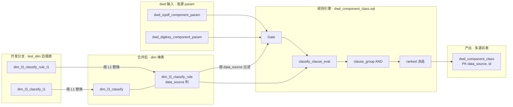
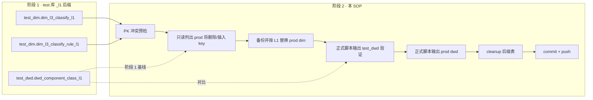

# 1.classify · 合入新 L1 / 新规则 SOP

适用场景：要把一个新 L1（电感 / PMIC / 驱动 IC 等）的**分类规则**合入主流程 `dim.dim_l3_classify` + `dim.dim_l3_classify_rule`，并重建 `dwd.dwd_component_class`。

> **必读前置**：[`sql_scripts/test/README.md`](../test/README.md) —— 新 L1 必须先在测试库带 `_<l1>` 后缀做完阶段 1 验证；本 SOP 是阶段 2 "合并到主流程" 的标准动作。  
> **端到端总图**：[`../L1_STD_PIPELINE.md`](../L1_STD_PIPELINE.md)（分类 + 属性） · [`L1_CLASSIFY_PIPELINE.md`](L1_CLASSIFY_PIPELINE.md)（仅分类）。

参考实施：电阻 / 二极管 / 电容合并（commit `0750d75` 之前）+ DigiKey 多源接入（commit `d8a4285`）。

---

## 0. 设计原则（必读）

### 0.1 开发期后缀隔离，合并期按 L1 替换

- `dim.dim_l3_classify` PK `l3_id`（六位段位，按 L1 分配，**不撞 `05x/10x/11x` 段**）
- `dim.dim_l3_classify_rule` PK `(rule_id, clause_group_id, clause_ord)`；`rule_id` **必须带 L1 前缀**（如 `inductor_*` / `gate_inductor_icpdf_v1`）
- **`dim.dim_l3_classify_rule` 有 `data_source` 列**：同一 L1 跨源（ICPDF / DigiKey / Mouser）规则可独立维护
- 新 L1 开发期的真相源是同事分支里的 `test_dim.dim_l3_classify_<l1>` / `test_dim.dim_l3_classify_rule_<l1>` 与 `sql_scripts/test/<l1>/` 脚本
- 合并期以 L1 为替换单元：先备份并删除生产 `dim` 中该 L1 旧 taxonomy / rule，再从 `test_dim` 后缀表插入新规则

### 0.2 分类合并内容边界

分类阶段合并的**业务内容只有两类**：

- 分类树：`dim.dim_l3_classify` ← `test_dim.dim_l3_classify_<l1>`
- 分类规则：`dim.dim_l3_classify_rule` ← `test_dim.dim_l3_classify_rule_<l1>`

`sql_scripts/1.classify/dwd_component_class.sql` 是共享规则引擎，合并时以主干最新版本为准，用于重跑和回归 `dwd.dwd_component_class`。同事分支里的 `build_dwd_component_class_<l1>.sql` 可能来自旧版本或包含临时优化，只作为阶段 1 清洗验证和问题排查参考，**不作为分类合并对象覆盖主干引擎**。如果同事发现引擎 bug 或性能问题，应单独提引擎修复 PR；业务语义仍保持 taxonomy + rule 驱动。

`l3_id` 采用 6 位数字，参考 `dim_l3_classify_all` 的编码习惯：

- 前两位：L1 大类顺序，L1 一旦确定原则上不改
- 中间两位：L2 在该 L1 下的顺序
- 后两位：L3 在该 L2 下的顺序

L2 / L3 拆分后续可能调整，但不要随意变更已分配的 L1 前两位；新增 L1 先查 `dim_l3_classify_all` 和当前 `dim.dim_l3_classify` 的已占前缀。

分类编码统一使用 lowercase snake_case。`l2_code` 不保留 `_base` 后缀；如果参考 schema 文档中出现 `xxx_base`，写入 `dim_l3_classify` 前改为 `xxx`。`l3_code` 同样使用 lowercase snake_case。

### 0.3 `dwd.dwd_component_class` 是多源共表

PK `(data_source, id)`，DDL 见 [`dwd_component_class.sql`](dwd_component_class.sql)。当前脚本是多源单脚本：在 `param_all` 统一 ICPDF / DigiKey 事实表，按 `data_source + gate_l1` 过滤规则，一次重建 `dwd.dwd_component_class`。

新增 L1 / L3 原则上只改 dim 后缀表与规则，不改引擎 SQL；新增数据源才需要扩 `param_all` 与对应 `data_source` 规则。

### 0.4 引擎约束

- 引擎实现唯一在 `dwd_component_class.sql` 的 `classify_clause_eval` CTE，谓词真值表由各 `field_code` 分支的 `UNION ALL` JOIN 条件定义
- 新增 `field_code` 必须同时改规则数据 + `classify_clause_eval` 分支，缺一不可
- 已废除 `schema_version='v1.5.09'` 硬编码（commit `0750d75`）；当前 `rules_classify` 按 `(l3_id, schema_version)` JOIN dim 自然隔离多版本
- 已废除 `l1_code='resistor'` 硬编码；引擎是真正多 L1 共用
- Gate 严格按 L1 进入：`gate_<l1>_<source>_vN` 必须存在；不要依赖“无 gate 放行全表”的旧语义

详细谓词与 phase / priority 决选语义见 [`RULE_ENGINE.md`](RULE_ENGINE.md)。

### 0.5 ❌ 反模式

- ❌ `LEFT JOIN best`（会把未分类写回表污染下游）；当前用 `INNER JOIN best`
- ❌ `dwd_component_class.sql` `rules_classify` 加 `AND d.l1_code = '<l1>'`（破坏多 L1 共用）
- ❌ `rule_id` 不带 L1 前缀（撞键）
- ❌ `l2_code` 带 `_base` 后缀，或 `l2_code` / `l3_code` 使用非 lowercase snake_case 命名
- ❌ MAP/ARRAY 字段用 SQL `map(...)` / `[...]` 字面量；跨脚本导入时统一用 JSON 字面量（双引号）
- ❌ 给已有 L1 的小规则改动套用新 L1 合并流程；小改动应单独评审变更范围后直接改生产规则
- ❌ 用 BSD `sed \b`（macOS 不支持）
- ❌ 合并新品类时人工拼接共享规则文件；应从 `test_dim` 后缀表按 L1 替换
- ❌ 用同事分支里的旧版 `build_dwd_component_class_<l1>.sql` 覆盖主干 `dwd_component_class.sql`

### 0.6 多人协作边界

- 每个新 L1 单独开 feature 分支，目录固定为 `sql_scripts/test/<l1>/`
- 分支内可以提交后缀表 DDL、规则草稿、build SQL、验收 SQL 和 README/progress note；不要修改共享生产规则，除非本次任务明确是维护已有 L1
- 分类阶段的交付物是：`test_dim.dim_l3_classify_<l1>`、`test_dim.dim_l3_classify_rule_<l1>`、阶段 1 可复跑脚本、分类验收结果；最终合并只取 taxonomy + rule 两张后缀表
- 合并时由合并人使用本 SOP / skill 做 L1 粒度替换和 prod 回归；同事不直接改 prod `dim.*`

### 0.7 数据流向（运行时）

> 谓词真值表、Gate / phase / priority 决选语义见 [`RULE_ENGINE.md`](RULE_ENGINE.md) §2。下游属性标准化依赖本层产出的 `dwd.dwd_component_class`。



当前由 [`dwd_component_class.sql`](dwd_component_class.sql) 的 `param_all` 一次处理 ICPDF / DigiKey；脚本会先删除目标源结果再全量插入命中行。

[`run_classify.sh`](run_classify.sh) 当前会先重建 dim，不适合新 L1 后缀表合并后的生产回归。新 L1 按后缀表写回生产 dim 后，**不要直接用 `run_classify.sh prod`**；应直接执行主干 [`dwd_component_class.sql`](dwd_component_class.sql) 重建 DWD。

---

## 1. 前置条件

- 仓库 clone，`sql_scripts/local.env` 或 shell `MYSQL_*` 已配
- 工作树干净（`git status`），从 `main` 切分支
- **阶段 1 已在 `sql_scripts/test/<l1>/` 跑通**：`test_dim.dim_l3_classify_<l1>` / `dim_l3_classify_rule_<l1>` 与 `test_dwd.dwd_component_class_<l1>` 验证通过（行数合理、L3 分布无吞噬），并在该目录 README 记录参考 schema、分类树版本、验收 SQL 与结果
- `rule_id` 带 L1 前缀（如 `inductor_*`、`gate_inductor_icpdf_v1`）
- `l3_id` 按 `LLMMNN` 六位规则分配：`LL` 参考 `dim_l3_classify_all` 的 L1 前两位，`MM` 是 L2 顺序，`NN` 是 L3 在 L2 下的顺序；新 L1 必须避开已占 L1 前缀

---

## 2. 流程总览

```text
0. 阶段 1 已完成（test 库 _<l1> 后缀验证通过）—— 见 sql_scripts/test/README.md

阶段 2：合并主流程（本 SOP）
  1. 接收同事分支并确认 test_dim/test_dwd 后缀表仍可复跑
  2. 合并边界 + PK / 命名 / gate 预检（只合并 classify + classify_rule；校验 l3_id / rule_id / data_source / schema_version）
  3. 只读比对 test_dim 后缀表与生产 dim 旧 L1，将要删除/插入的 key 列出来
  4. 用户确认后，ALLOW_PROD=1：备份生产旧 L1 → 删除生产旧 L1 → 从 test_dim 后缀表插入生产 dim
  5. 用主干 dwd_component_class.sql 输出到 test_dwd 临时表，先验证并对比阶段 1 结果
  6. 验证通过后，直接执行主干 dwd_component_class.sql 重跑 prod dwd_component_class（不要走会重建 dim 的 runner）
  7. 校验各 (data_source, l1) 行数、L3 分布和已有 L1 漂移
  8. cleanup test_dim/test_dwd 后缀表与 sql_scripts/test/<l1>
  9. git commit + push（不在本步骤自动合并其他分支）
```

### 2.1 阶段 2 合并流向（SOP）



---

## 3. 详细步骤

### Step 1 · PK 冲突预检

```sql
-- l3_id：必须 0；允许替换同一 L1 的旧 id，但不能撞到其他 L1
SELECT COUNT(*) FROM (
  SELECT l3_id FROM dim.dim_l3_classify WHERE l1_code <> '<l1>'
  UNION ALL SELECT l3_id FROM test_dim.dim_l3_classify_<l1>
) u GROUP BY l3_id HAVING COUNT(*)>1;

-- rule PK：必须 0；允许替换同一 L1 的旧 rule，但不能撞到其他 L1 / 其他前缀
WITH prod_keep_rule AS (
  SELECT r.rule_id, r.clause_group_id, r.clause_ord
  FROM dim.dim_l3_classify_rule r
  LEFT JOIN dim.dim_l3_classify d
    ON d.l3_id = r.l3_id AND d.schema_version = r.schema_version
  WHERE COALESCE(d.l1_code, '') <> '<l1>'
    AND r.rule_id NOT REGEXP '^<l1>_'
    AND r.rule_id NOT REGEXP '^gate_<l1>_'
)
SELECT COUNT(*) FROM (
  SELECT rule_id, clause_group_id, clause_ord FROM prod_keep_rule
  UNION ALL SELECT rule_id, clause_group_id, clause_ord FROM test_dim.dim_l3_classify_rule_<l1>
) u GROUP BY rule_id, clause_group_id, clause_ord HAVING COUNT(*)>1;
```

返回非 0 → 停下，让 owner 改 `l3_id` 段位或加 `<l1>_` 前缀重做阶段 1。这里检查的是“撞到其他 L1/其他规则”，不是同 L1 替换。

### Step 2 · 合并前质量检查

对后缀表做最小审计，避免把不完整规则写入共享 dim。分类合并只处理 `test_dim.dim_l3_classify_<l1>` 和 `test_dim.dim_l3_classify_rule_<l1>`；不要把同事分支里的旧版 `build_dwd_component_class_<l1>.sql` 合进主干引擎。

```sql
-- taxonomy 必须全是本 L1
SELECT l1_code, COUNT(*) FROM test_dim.dim_l3_classify_<l1> GROUP BY 1;

-- l3_id 必须是 6 位数字；前两位必须落在该 L1 的规划段
SELECT l3_id, l1_code, l2_code, l3_code
FROM test_dim.dim_l3_classify_<l1>
WHERE l3_id NOT REGEXP '^[0-9]{6}$'
   OR LEFT(l3_id, 2) <> '<l1_id_prefix>';

-- l2_code / l3_code 必须是 lowercase snake_case；l2_code 禁止 _base 后缀
SELECT l2_code, l3_code, COUNT(*) AS rows_
FROM test_dim.dim_l3_classify_<l1>
WHERE l2_code REGEXP '_base$'
   OR l2_code NOT REGEXP '^[a-z0-9]+(_[a-z0-9]+)*$'
   OR l3_code NOT REGEXP '^[a-z0-9]+(_[a-z0-9]+)*$'
GROUP BY 1, 2;

-- rule_id 命名：gate_<l1>_<source>_vN 或 <l1>_*
SELECT rule_id, COUNT(*)
FROM test_dim.dim_l3_classify_rule_<l1>
WHERE rule_id NOT REGEXP '^<l1>_' AND rule_id NOT REGEXP '^gate_<l1>_'
GROUP BY 1;

-- 每个 data_source 至少有 gate；当前引擎不再把空 gate 当全量放行
SELECT data_source, COUNT(*) AS gate_rows
FROM test_dim.dim_l3_classify_rule_<l1>
WHERE enabled = 1 AND rule_kind = 'gate'
GROUP BY 1;
```

返回异常 → 停下，让 owner 在阶段 1 分支修正后重跑。

### Step 3 · 只读确认生产替换范围

不要删除或改写 `test_dim` 主表。测试库后缀表是本次合并的数据来源，生产 `dim` 是替换目标。先只读列出生产将删除的旧 key、以及将从测试库写入的新 key：

```sql
-- 生产旧 taxonomy
SELECT l3_id, schema_version, l1_code, l2_code, l3_code
FROM dim.dim_l3_classify
WHERE l1_code = '<l1>'
ORDER BY l3_id, schema_version;

-- 生产旧 rule：按 l3 归属 + rule_id 前缀双保险定位
SELECT r.rule_id, r.clause_group_id, r.clause_ord, r.data_source, r.l3_id, r.schema_version
FROM dim.dim_l3_classify_rule r
LEFT JOIN dim.dim_l3_classify d
  ON d.l3_id = r.l3_id AND d.schema_version = r.schema_version
WHERE d.l1_code = '<l1>'
   OR r.rule_id REGEXP '^<l1>_'
   OR r.rule_id REGEXP '^gate_<l1>_'
ORDER BY r.rule_id, r.clause_group_id, r.clause_ord;

-- 测试库待写入新 taxonomy/rule 行数
SELECT 'new_taxonomy' AS t, COUNT(*) FROM test_dim.dim_l3_classify_<l1>
UNION ALL
SELECT 'new_rule' AS t, COUNT(*) FROM test_dim.dim_l3_classify_rule_<l1>;
```

把上述结果给人工确认：删除范围必须只覆盖该 L1；插入行数必须等于阶段 1 验收的后缀表行数。

### Step 4 · prod dim 按 L1 替换发布

用户确认后，在生产 `dim` 执行备份、删除、插入。以下 SQL 是模板，实际执行前把 `<l1>` 替换成小写 L1 code，并把 `<merge_tag>` 替换成本次合并标识（建议 `YYYYMMDDHHMM` 或分支短名），避免复用旧备份表。

```sql
CREATE TABLE dim.bak_dim_l3_classify_<l1>_<merge_tag> AS
SELECT * FROM dim.dim_l3_classify WHERE l1_code = '<l1>';

CREATE TABLE dim.bak_dim_l3_classify_rule_<l1>_<merge_tag> AS
SELECT r.*
FROM dim.dim_l3_classify_rule r
LEFT JOIN dim.dim_l3_classify d
  ON d.l3_id = r.l3_id AND d.schema_version = r.schema_version
WHERE d.l1_code = '<l1>'
   OR r.rule_id REGEXP '^<l1>_'
   OR r.rule_id REGEXP '^gate_<l1>_';

DELETE FROM dim.dim_l3_classify_rule
WHERE rule_id REGEXP '^<l1>_'
   OR rule_id REGEXP '^gate_<l1>_'
   OR (l3_id, schema_version) IN (
        SELECT l3_id, schema_version
        FROM dim.dim_l3_classify
        WHERE l1_code = '<l1>'
      );

DELETE FROM dim.dim_l3_classify WHERE l1_code = '<l1>';

INSERT INTO dim.dim_l3_classify
SELECT * FROM test_dim.dim_l3_classify_<l1>;

INSERT INTO dim.dim_l3_classify_rule
SELECT * FROM test_dim.dim_l3_classify_rule_<l1>;
```

如果 StarRocks 当前版本不支持多列 `IN` 子查询，改用临时表保存 `l3_id + schema_version`，再按单列 `rule_id` / `l3_id` 分步删除。

执行前必须确认：

- `ALLOW_PROD=1` 是用户明确授权，不由 agent 自行假定
- 当前分支已经包含该 L1 的阶段 1 脚本和验收记录
- prod 旧 L1 备份表已用本次 `<merge_tag>` 创建，且 `SELECT COUNT(*)` 有记录可追溯

### Step 5 · test_dwd 跑正式脚本验证

生产 dim 替换完成后，先用主干 `dwd_component_class.sql` 的正式逻辑输出到 `test_dwd` 临时表，对比阶段 1 的 `test_dwd.dwd_component_class_<l1>`。注意这里只替换输出表，**不要替换 `dim.` 和源 `dwd.dwd_<source>_component_param`**，否则就不是生产规则 + 生产事实表的正式回归。

```bash
python3 - <<'PY' > /tmp/dwd_component_class_to_test_dwd_<l1>.sql
from pathlib import Path

src = Path("sql_scripts/1.classify/dwd_component_class.sql").read_text(encoding="utf-8")
out_table = "test_dwd.dwd_component_class_merge_<l1>"
src = src.replace("dwd.dwd_component_class", out_table)
Path("/tmp/dwd_component_class_to_test_dwd_<l1>.sql").write_text(src, encoding="utf-8")
PY

set -a
source sql_scripts/local.env
set +a
mysql -h "${MYSQL_HOST:-192.168.19.21}" -P "${MYSQL_PORT:-9030}" \
  -u "${MYSQL_USER:-root}" "-p${MYSQL_PASSWORD}" \
  --default-character-set=utf8mb4 \
  < /tmp/dwd_component_class_to_test_dwd_<l1>.sql
```

对比查询：

```sql
-- 正式脚本输出的新 L1 行数
SELECT data_source, l1_code, COUNT(*) AS rows_
FROM test_dwd.dwd_component_class_merge_<l1>
WHERE l1_code = '<l1>'
GROUP BY 1, 2 ORDER BY 1, 2;

-- 阶段 1 后缀表基线
SELECT data_source, l1_code, COUNT(*) AS rows_
FROM test_dwd.dwd_component_class_<l1>
WHERE l1_code = '<l1>'
GROUP BY 1, 2 ORDER BY 1, 2;

-- L3 分布对比
SELECT 'merge' AS src, data_source, l3_code, COUNT(*) AS rows_
FROM test_dwd.dwd_component_class_merge_<l1>
WHERE l1_code = '<l1>'
GROUP BY 1, 2, 3
UNION ALL
SELECT 'phase1' AS src, data_source, l3_code, COUNT(*) AS rows_
FROM test_dwd.dwd_component_class_<l1>
WHERE l1_code = '<l1>'
GROUP BY 1, 2, 3
ORDER BY data_source, l3_code, src;
```

验收：新 L1 行数与阶段 1 基线差异在预期范围内，L3 分布无异常吞噬；异常时不要继续写 prod DWD，先回到规则表排查。

### Step 6 · prod 重跑 classify

```bash
# 重要：不要用 run_classify.sh prod；它会先重建 dim，覆盖本次从 test_dim 写入的生产 dim。
# 这里直接执行主干引擎 SQL，只重建 dwd.dwd_component_class。
set -a
source sql_scripts/local.env
set +a
mysql -h "${MYSQL_HOST:-192.168.19.21}" -P "${MYSQL_PORT:-9030}" \
  -u "${MYSQL_USER:-root}" "-p${MYSQL_PASSWORD}" \
  --default-character-set=utf8mb4 \
  < sql_scripts/1.classify/dwd_component_class.sql
```

当前 `dwd_component_class.sql` 是多源单脚本，会重建 ICPDF + DigiKey 两个源的 `dwd.dwd_component_class` 数据。若未来需要只跑部分源，应先改主干引擎或提供不会重建 dim 的 runner 参数。

### Step 7 · 校验

```sql
SELECT data_source, l1_code, COUNT(*) AS rows_
FROM dwd.dwd_component_class
GROUP BY 1, 2 ORDER BY 1, 2;
```

- 新 L1 应出现
- 已有 L1（ICPDF resistor/cap/diode/...）行数与 prod 老表 / 阶段 1 测试基线 ±0.5%
- 大于 1% 漂移 → 排查 dim 规则是否被同事悄悄改了，或 ods/param 源数据有增量

### Step 8 · cleanup

```sql
DROP TABLE IF EXISTS test_dim.dim_l3_classify_<l1>;
DROP TABLE IF EXISTS test_dim.dim_l3_classify_rule_<l1>;
DROP TABLE IF EXISTS test_dwd.dwd_component_class_<l1>;
DROP TABLE IF EXISTS test_dwd.dwd_component_class_merge_<l1>;
```

```bash
git rm -r sql_scripts/test/<l1>/   # 若该 L1 的属性标准化也已合并；否则保留
```

### Step 9 · commit + push

```bash
git add sql_scripts/test/<l1>/ sql_scripts/1.classify/CONTRIB.md sql_scripts/1.classify/RULE_ENGINE.md
git commit -m "feat(classify): add <l1> taxonomy validation scripts

prod 行数（dwd.dwd_component_class）：
- icpdf.<l1>: NNN,NNN
- digikey.<l1>: NNN,NNN  (如有)
"
# user 明确确认后 git push
```

---

## 4. 失败回滚

| 现象 | 处理 |
|---|---|
| Step 1 PK 冲突 | 停下，让 owner 改 `l3_id` 段位 / `rule_id` 加 `<l1>_` 前缀重做阶段 1 |
| Step 2 命名检查失败 | 停下，让 owner 在分支内统一 `rule_id`、`data_source`、`schema_version` 后重跑阶段 1 |
| Step 3 替换范围不确定 | 先只查不删，列出生产将删除的 `rule_id` / `l3_id` 给人工确认；必要时建临时表驱动删除 |
| Step 4 写入生产后行数异常 | 对比本次 `dim.bak_*_<l1>_<merge_tag>`、`test_dim.*_<l1>` 与生产主表，检查 gate、data_source、schema_version 是否变了 |
| Step 5 test_dwd 验证新 L1 行数 = 0 | 缺 `gate_<l1>_<source>_v1` 规则；检查 dim_l3_classify_rule 既有 gate 又有 classify 行 |
| Step 5 build crash `parjson_match_map` | `match_map` 不是合法 JSON 对象（单引号无效） |
| Step 6 不小心用了 `run_classify.sh prod` | 它会重建 dim，可能覆盖本次合并；立即检查 `dim.dim_l3_classify*` 该 L1 是否还在，必要时从 `test_dim.*_<l1>` 重新执行 Step 4 |
| Step 7 已有 L1 漂移 > 1% | 本次替换范围可能误删跨 L1 规则；用备份表恢复并逐条排查 enabled / priority |
| 误写 prod | 优先从本次 `dim.bak_*_<l1>_<merge_tag>` 恢复该 L1，不要全量 DROP 主表 |

---

## 5. 常见坑

- **MAP 字段写法**：跨脚本导入时用 `{"k":"v"}` JSON 字面量，**不是** SQL `map(...)`
- **ARRAY 字段写法**：跨脚本导入时用 `["A","B"]` JSON 数组字面量，**不是** SQL `[...]`
- **`schema_version` 多版本共存**：dim 表可以并存 v1.5.09 / v1.5.20 等多版；引擎按 `(l3_id, schema_version)` JOIN 自然隔离，不用 hardcode（commit `0750d75` 已移除 `r.schema_version = 'v1.5.09'`）
- **`enabled=0`** 可保留在规则表中，但 build SQL `WHERE r.enabled = 1` 自动跳过
- **dwd 跑 ICPDF classify ~5 min / 600K param 行**属正常水位；不要把 `INNER JOIN best` 改 `LEFT JOIN`（会写未分类污染下游）
- **`data_source` 列**：dim_l3_classify_rule 装规则时 `data_source='icpdf'` 是默认值；如做新源（DigiKey/Mouser）必须显式标 `data_source='<src>'`，build SQL 才能按源过滤
- **macOS sed `\b` 不工作**：渲染 test_dwd 时用精确字面匹配或 python re.sub

---

## 6. 工具脚本

| 路径 | 用途 |
|---|---|
| [`run_classify.sh`](run_classify.sh) | 当前会先重建 dim；新 L1 后缀表合并后不要直接用于 prod |
| `sql_scripts/test/<l1>/run_test.sh` | 新 L1 阶段 1 一键验证入口，由 owner 在分支内维护 |

---

## 7. 相关路径

- 引擎实现 + DDL：[`dwd_component_class.sql`](dwd_component_class.sql)（多源单脚本）
- dim DDL：[`dim_l3_classify.sql`](dim_l3_classify.sql) / [`dim_l3_classify_rule.sql`](dim_l3_classify_rule.sql)
- 引擎语义：[`RULE_ENGINE.md`](RULE_ENGINE.md)
- 规则扩展模板：[`rule_engine_extension_template.sql`](rule_engine_extension_template.sql)
- 阶段 1 测试库后缀流程：[`../test/README.md`](../test/README.md)
- 属性标准化合并 SOP：[`../2.attribute_standard/CONTRIB.md`](../2.attribute_standard/CONTRIB.md)
- multi-source cutover 历史：[`../PROD_CUTOVER.md`](../PROD_CUTOVER.md)
