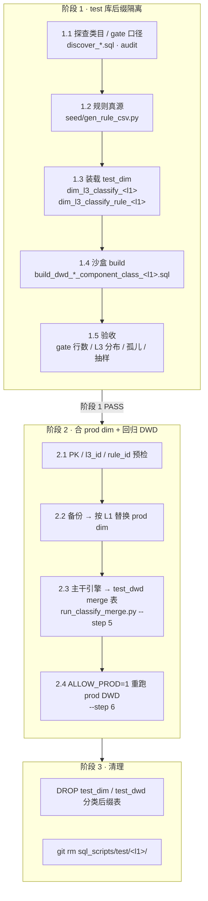
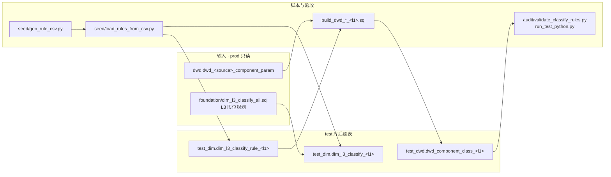
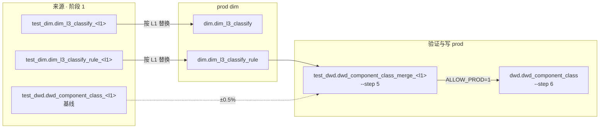
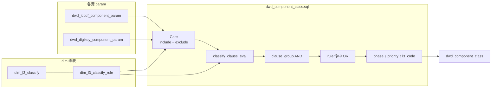

# L1 分类清洗 · 端到端总览

适用：新接入或重做某个 **L1 大类**（如 `data_converter`、`inductor`）的 **gate + classify** 规则，在 test 库验证后合入 prod。

| 相关文档 | 说明 |
|---|---|
| [`../L1_STD_PIPELINE.md`](../L1_STD_PIPELINE.md) | 分类 + 属性完整总图 |
| [`CONTRIB.md`](CONTRIB.md) | 阶段 2 合并 SOP（逐步 SQL） |
| [`RULE_ENGINE.md`](RULE_ENGINE.md) | gate / classify 谓词与决选语义 |
| [`../test/README.md`](../test/README.md) | test 库后缀表命名与三阶段约定 |

---

## 1. 三阶段总图



**合并边界**：只合并 `dim_l3_classify` + `dim_l3_classify_rule`；`dwd_component_class.sql` 以主干最新引擎为准，不用沙盒 build 覆盖。

---

## 2. 阶段 1 详图

目录：`sql_scripts/test/<l1>/`



| 步骤 | 动作 | 典型产物 |
|---|---|---|
| 1.1 | 探查 gate 口径（`category` / `note_cn` / `category2`） | `audit/discover_*.sql` |
| 1.2 | 编写 gate（include + exclude）与 classify 规则 | `seed/gen_rule_csv.py` |
| 1.3 | 装载 `test_dim` 后缀表 | `seed/load_rules_from_csv.py` |
| 1.4 | 沙盒跑分类（简化 build 或复制引擎逻辑） | `build_dwd_*_component_class_<l1>.sql` |
| 1.5 | 离线 + DB 验收 | `audit/validate_classify_rules.py`、`run_classify_merge.py --step 5`（合 prod 前） |

**验收硬指标**

- gate 放行行数稳定，且与业务口径一致
- gate 内 classify 覆盖率 **100%**（无孤儿 SKU）
- L3 分布合理（无单 L3 吞噬全部行）
- 阶段 1 基线与主干引擎 merge 表偏差 **≤ ±0.5%**

---

## 3. 阶段 2 详图（合 prod）



| 步骤 | 动作 | 入口 |
|---|---|---|
| 2.1 | PK / `l3_id` / `rule_id` 预检 | [`CONTRIB.md`](CONTRIB.md) Step 1 |
| 2.2 | 备份 → 删除 prod 旧 L1 dim → 插入 test_dim | skill `dim-l3-classify-merge` 或 CONTRIB Step 4 |
| 2.3 | 主干 `dwd_component_class.sql` → merge 表 | `test/<l1>/audit/run_classify_merge.py --step 5` |
| 2.4 | 重跑 prod `dwd.dwd_component_class` | `--step 6`（需 `ALLOW_PROD=1`） |

**注意**

- **不要**用 `run_classify.sh prod`（会重建 dim）；直接跑 [`dwd_component_class.sql`](dwd_component_class.sql)。
- 合 prod 后校验各 `(data_source, l1)` 行数、L3 分布，确认其他 L1 无漂移。

---

## 4. 运行时引擎（每次重跑 DWD）

谓词与决选细节见 [`RULE_ENGINE.md`](RULE_ENGINE.md)。



### 4.1 Gate

**公式**：`gate_pass = gate_include − gate_exclude`（按 `data_source + id + l1_code`）。

| `field_code` | 角色 |
|---|---|
| `category_in` | include：`category ∈ match_values` |
| `category2_in` | include：`category2 ∈ match_values` |
| `gate_exclude_note_cn` | exclude：`category = match_value` 且 `note_cn` LIKE 任一模式 |
| `gate_exclude_null_note_cn` | exclude：`category = match_value` 且 `note_cn IS NULL` |

**`rule_id` 命名**

- gate：`gate_<l1>_<source>_…`（exclude 行亦须含 `_<source>_` 锚点，引擎据此解析 `l1_code`）
- classify：`<l1>_…_vN`（`data_converter` 存量 classify 可用 `dcv_` 前缀，gate 不可用缩写）

### 4.2 Classify 决选

1. 组内 **AND**（`clause_ord`）
2. 组间 **OR**（`clause_group_id`）
3. 命中多规则时：`phase DESC` → `rule_priority ASC` → `l3_code ASC`
4. 仅 gate 通过且命中 classify 的 SKU 写入 DWD（`INNER JOIN best`）

---

## 5. 阶段 3 清理

```sql
DROP TABLE IF EXISTS test_dim.dim_l3_classify_<l1>;
DROP TABLE IF EXISTS test_dim.dim_l3_classify_rule_<l1>;
DROP TABLE IF EXISTS test_dwd.dwd_component_class_<l1>;
DROP TABLE IF EXISTS test_dwd.dwd_component_class_merge_<l1>;
```

```bash
git rm -r sql_scripts/test/<l1>/
```

属性相关后缀表与 `test/<l1>/` 中属性脚本，在属性阶段合 prod 后再清理，见 [`../L1_STD_PIPELINE.md`](../L1_STD_PIPELINE.md)。

---

## 6. 脚本与 Skill 索引

| 路径 | 说明 |
|---|---|
| [`dwd_component_class.sql`](dwd_component_class.sql) | 共享分类引擎（唯一真源） |
| [`dim_l3_classify.sql`](dim_l3_classify.sql) / [`dim_l3_classify_rule.sql`](dim_l3_classify_rule.sql) | dim DDL |
| [`CONTRIB.md`](CONTRIB.md) | 阶段 2 逐步 SOP |
| `.cursor/skills/dim-l3-classify-merge/SKILL.md` | Cursor skill：分类合 prod |
| `sql_scripts/test/<l1>/audit/run_classify_merge.py` | Step 5/6 验收辅助 |
| `sql_scripts/test/data_converter/` | DigiKey ADC/DAC 参考试点 |

---

## 7. 参考数字（data_converter · DigiKey）

| 口径 | 行数 |
|---|---:|
| 四门 `category_in` include | 11,276 |
| combo `note_cn` exclude | 173 |
| **gate_pass / prod 分类** | **11,103** |

gate dim 规则（prod）：

- `gate_data_converter_digikey_v2` — `category_in`
- `gate_data_converter_digikey_exclude_combo_amp_v1` — `gate_exclude_note_cn`
- `gate_data_converter_digikey_exclude_combo_null_v1` — `gate_exclude_null_note_cn`
