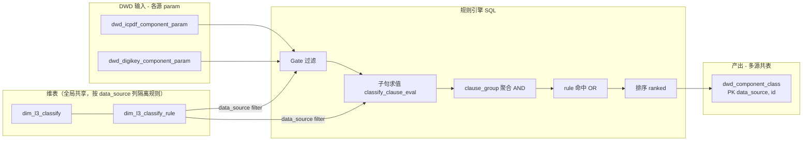

# ICDPDF / DigiKey L3 分类规则引擎说明

本文描述 `sql_scripts/1.classify/` 下 **taxonomy（维表）→ 规则（子句）→ DWD 判定 SQL** 的分工与语义，供电阻 / 电容 / 二极管之外的品类（电感、PMIC、驱动 IC、…）和新数据源（DigiKey / Mouser / …）复用同一套「引擎」。

**核心约定**：引擎的**唯一实现**在 StarRocks SQL 中——谓词真值表见 [`dwd_component_class.sql`](dwd_component_class.sql) 内 CTE `classify_clause_eval` 的各 `field_code` 分支（`UNION ALL` + JOIN 条件）。新增 `field_code` 必须同时改规则数据与该 CTE，缺一不可。

> 接入新 L1 / 新规则请走 [`CONTRIB.md`](CONTRIB.md) + [`../test/README.md`](../test/README.md) 的测试库后缀流程。

---

## 1. 数据对象与职责

| 对象 | 脚本 | 职责 |
|------|------|------|
| **L3 分类树** | [`dim_l3_classify.sql`](dim_l3_classify.sql) | 定义 `l3_id`、`l1/l2/l3_code`、中英名称、`schema_version`。规则表通过 `l3_id` + `schema_version` 与之关联。 |
| **规则子句表** | [`dim_l3_classify_rule.sql`](dim_l3_classify_rule.sql) | 存放 **gate**（是否进入流水线）与 **classify**（具体落 `l3_id`）的**原子谓词行**。一行 = 一个谓词；通过 `clause_group_id` / `clause_ord` 组合成逻辑式。**带 `data_source` 列**做多源隔离。 |
| **分类结果 DWD（多源共表）** | [`dwd_component_class.sql`](dwd_component_class.sql) | 在 `param_all` 统一各源 `dwd_<source>_component_param` + 上述 dim，执行 gate → 展开 classify → **组内 AND、组间 OR** → 规则命中 → **phase / priority / tie-break** 决出每 `(data_source, id)` 唯一一行；写入同张 `dwd.dwd_component_class`，PK `(data_source, id)`。 |

分类合并的业务输入只包含前两张 dim 表：`dim_l3_classify` 与 `dim_l3_classify_rule`。`dwd_component_class.sql` 是共享引擎，以主干最新版本为准；测试分支里的旧版 build SQL 只用于阶段 1 验证和排查，不作为合并对象。

`l3_id` 采用 `LLMMNN` 六位数字：`LL` 参考 `dim_l3_classify_all` 的 L1 大类顺序，`MM` 是 L2 顺序，`NN` 是 L3 在 L2 下的顺序。L1 前两位原则上稳定，L2/L3 可以在同一 L1 段内随 schema 演进调整。

`l2_code` / `l3_code` 统一使用 lowercase snake_case；`l2_code` 不保留 `_base` 后缀。

输入事实表（每源行粒度一致）：
- `dwd.dwd_icpdf_component_param`（ICPDF）
- `dwd.dwd_digikey_component_param`（DigiKey）
- 未来 `dwd.dwd_<source>_component_param`

通用列：`category`、`category2`、`taginfo`、`category_info`、`note_cn`、`prajson` / `prajson2`。

---

## 2. 端到端流水线



当前由 `dwd_component_class.sql` 的 `param_all` 一次处理 ICPDF / DigiKey；各源只取 `data_source='<src>'` 的规则，写入同一张 `dwd.dwd_component_class` 表的不同 `data_source` 分区段。新增数据源时扩 `param_all`，新增 L1 时只补 `gate_<l1>_<source>_vN` 与 classify 规则。

---

## 3. `dim_l3_classify_rule` 行语义

### 3.1 主键与粒度

- **主键**：`(rule_id, clause_group_id, clause_ord)`
- `rule_id` 必须带 L1 / 源前缀（如 `inductor_*`、`gate_resistor_digikey_v1`），避免撞键
- 同一 `rule_id` 下：
  - **`clause_group_id`**：条件**组**编号；**不同组之间为 OR**（任一组全满足则该 `rule_id` 命中）
  - **`clause_ord`**：组内行序号；**组内所有行的谓词为 AND**（全部 `clause_ok` 该组才通过）

### 3.2 `rule_kind`

| 值 | 含义 |
|----|------|
| **gate** | 仅用于「是否进入本数据源 / 本 L1」过滤；**不写 `l3_id`**。当前实现取 `field_code IN ('category_in','category2_in')` 的白名单并展开；详见 §4。 |
| **classify** | 产出 L3；**必须能 JOIN `dim_l3_classify`**（`l3_id`、`schema_version` 一致）。 |

### 3.3 `data_source`

- 列默认值 `'icpdf'`，DigiKey 规则填 `'digikey'`，新源同理
- 各源的 build SQL `WHERE r.data_source = '<src>'` 过滤，互不干扰
- 同一 L1 在不同源下规则可独立（DigiKey 的电阻分类树与 ICPDF 不同）

### 3.4 `phase` / `rule_priority` / `confidence_weight`

- **`phase`**：数值越大越优先参与最终裁决。电阻示例：**3 = JSON 消解**、**2 = 类目/标签**、**1 = 入口**
- 同 `phase` 内：**`rule_priority` 越小越优先**（专指靠前，弱兜底靠后）
- `confidence_weight`：引擎对命中规则的 confidence 在 phase 基础系数上乘以本权重，上限截断为 1；详见 `dwd_component_class.sql` 中 `hits` CTE

二者共同用于最终排序（见 §6）。

### 3.5 `classify_source_hint`（产出元数据，非 GROUP BY 键）

**适用范围**：仅 **classify** 多子句 AND；**gate** 为单行 `category_in` / `category2_in` 白名单，不走 `classify_group_pass`，**无 hint 拼接**。v1 设计按 **classify 双字句**（两子句、hint 可不同）验收即可。

- 每个 classify 子句行（`clause_ord` 0, 1, …）可独立填 `classify_source_hint`。
- **组内 AND 判定**：`rule_group_clause_cnt` 统计组内行数；`HAVING COUNT(DISTINCT clause_ord) = need.clause_cnt` 要求全部子句命中，与 hint 取值无关。
- **组内 hint 合并**（写入 `classify_source`）：`classify_group_pass` 用  
  `array_join(array_distinct(array_agg(hint ORDER BY clause_ord)), '+')`  
  按 `clause_ord` 去重拼接；**不得**把 `classify_source_hint` 放入 `GROUP BY`，否则双字句 rule 会被拆散。

| v1 典型（2 子句） | 子句 hint | 合并结果 |
|-------------------|-----------|----------|
| 类目 + prajson | `digikey_category` + `parjson_match_map` | `digikey_category+parjson_match_map` |
| 类目 + note | `digikey_category` + `note_cn_regexp` | `digikey_category+note_cn_regexp` |
| 全相同（如 data_converter） | 全填 `prajson` | `prajson` |

- 单个子句 hint 受 dim 列 `VARCHAR(32)` 约束；双字句拼接约 34–35 字符，故 `dwd_component_class.classify_source` 用 **VARCHAR(64)**。存量表需 `ALTER`。

---

## 4. Gate（入口过滤）

Gate 规则来自 `rule_kind = 'gate'`。`rule_id` 遵循 `gate_<l1>_<source>_…`；`l1_code` 由 SQL 在 `_digikey_` / `_icpdf_` 锚点切出（支持 `data_converter`、`mcu_mpu_dsp` 等多段 L1 名）。exclude 行亦须带同一锚点，例如 `gate_data_converter_digikey_exclude_combo_amp_v1`。

**语义**：`gate_pass = gate_include − gate_exclude`（按 `(data_source, id, l1_code)`）。

| `field_code` | 角色 | 说明 |
|---|---|---|
| `category_in` | include | `category ∈ match_values` |
| `category2_in` | include | `category2 ∈ match_values` |
| `category_with_null_category2_in` | include | `category2 IS NULL` 且 `category ∈ match_values`（如 ICPDF `LED驱动器` + 空 `category2`） |
| `gate_exclude_note_cn` | exclude | `category = match_value` 且 `note_cn` 命中 `match_values` 中任一 LIKE 模式 |
| `gate_exclude_null_note_cn` | exclude | `category = match_value` 且 `note_cn IS NULL` |
| `gate_exclude_category_like` | exclude | `category` 命中 `match_values` 中任一 LIKE 模式（评估板/开发套件/演示板等整类排除） |
| `gate_exclude_category2_in` | exclude | `category2 ∈ match_values`（跨 L1 协调： rival gate 让渡 CP 叶） |
| `gate_exclude_category2_note_cn` | exclude | `category2 = match_value` 且 `note_cn` 命中 `match_values` 中任一 LIKE 模式 |

include 与 exclude 均按同一 `l1_code` 分组；命中任一 exclude 即不进 classify。实现见 `dwd_component_class.sql` 中 `gate_include` / `gate_exclude` / `gate_pass` CTE。旧版仅 `category_in`/`category2_in` 的片段如下（已扩展 exclude）：

```81:112:sql_scripts/1.classify/dwd_component_class.sql
rules_gate AS (
    SELECT
        data_source,
        split_part(rule_id, '_', 2) AS l1_code,
        field_code,
        match_values
    FROM dim.dim_l3_classify_rule
    WHERE enabled = 1
      AND rule_kind = 'gate'
),
/* (id, data_source, gate_l1)：单 L1 gate 第一入口；array_contains OR 连接 */
gate_pass AS (
    SELECT p.id, p.data_source, gr.l1_code
    FROM param_all p
    INNER JOIN rules_gate gr
        ON gr.data_source = p.data_source
       AND ((gr.field_code = 'category_in'
             AND gr.match_values IS NOT NULL
             AND array_contains(gr.match_values, p.category))
         OR (gr.field_code = 'category2_in'
             AND gr.match_values IS NOT NULL
             AND array_contains(gr.match_values, p.category2)))
    GROUP BY p.id, p.data_source, gr.l1_code
),
```

**扩展注意**：新 L1 必须至少有 include 行；无 gate 不会全表放行。

---

## 5. 谓词类型 `field_code`（classify）

以下是当前已实现的谓词。**新增品类**时优先复用，确需新语义时再增加 `field_code` 并在 `classify_clause_eval` 补分支。

| `field_code` | 主要列 | 语义摘要 |
|--------------|--------|----------|
| `category_eq` | `match_value` | `category` 精确等于 |
| `category2_eq` | `match_value` | `category2` 精确等于 |
| `category_in` | `match_values` | `category ∈ match_values` |
| `category2_in` | `match_values` | `category2 ∈ match_values` |
| `category_like` | `match_value` | `category LIKE match_value` |
| `category2_like` | `match_value` | `category2 LIKE match_value` |
| `taginfo_overlap` | `match_values` | `taginfo` 数组与 `match_values` **arrays_overlap** |
| `category_info_overlap` | `match_values` | 同上，作用于 `category_info` |
| `note_cn_regexp` | `match_value` | `note_cn REGEXP match_value` |
| `note_regexp` | `match_value` | `note REGEXP match_value`（英文 note） |
| `partno_regexp` | `match_value` | `partno REGEXP match_value` |
| `parjson_match_map` | `match_map` | **`prajson`** 顶层键：对每个 `(键 → LIKE模式)`，`get_json_string` 后**整串 LIKE**；**所有键均命中**为真 |
| `parjson2_match_map` | `match_map` | 同上，作用于 **`prajson2`** |

实现锚点见 `dwd_component_class.sql` 中 `classify_clause_eval` CTE。每个 `field_code` 一段 `UNION ALL`，通过 `(data_source, gate_l1)` 限定候选规则，避免旧版 `INNER JOIN ... ON TRUE` 的笛卡尔积。

**`parjson_match_map` / `parjson2_match_map` 要点**：
- **列由 field_code 显式声明**：`parjson_match_map`→`prajson`，`parjson2_match_map`→`prajson2`。
  icpdf 的 K-V 规格在 `prajson2`（用 `parjson2_match_map`）；digikey 在 `prajson`（用 `parjson_match_map`）。
  引擎不再按数据源猜列——加新源只需在事实表暴露对应列、规则选对 field_code。
- JSON 路径：`concat('$."', k, '"')`，键名含中文/空格时需与实际 JSON 一致
- 比较前对 JSON 取出字符串做 `LOWER`，模式侧 `LOWER(TRIM(...))`，便于英文枚举兼容大小写

---

## 6. 规则命中后的排序（决选）

对同一 `id` 可能多条规则命中，引擎在 `ranked` 中取 `rn = 1`：

```sql
ROW_NUMBER() OVER (
    PARTITION BY id
    ORDER BY phase DESC, rule_priority ASC, l3_code ASC
) AS rn
```

即：**phase 大者优先**；同 phase **`rule_priority` 小者优先**；仍并列则 **`l3_code` 字典序**（避免 StarRocks 非确定性）。

注意：因为新表 PK 是 `(data_source, id)`，不同源同 id 不会互踩；同源内仍是按 id 唯一一行。

---

## 7. 实践要点（供对齐）

更细的品类编排（NTC/PTC phase3、115001 双档 category2_in、taginfo 弱于 category 等）写在测试期 `test_dim.dim_l3_classify_rule_<l1>` / 历史 seed 的 `note` 列；此处强调**模式**：

1. **专指优先、兜底靠后**：同一 L3 用不同 `rule_priority` 分层
2. **同一 L3 多路径**：用 **`clause_group_id` 分支 OR**（例如 JSON 路径与类目路径并存）
3. **JSON 与类目冲突**：提高 JSON 所在 **`phase`**，并在 `note` 写明与兜底规则的先后关系
4. **跨源同 L3**：DigiKey 与 ICPDF 同一 L3 各自维护规则（不同 `rule_id` + `data_source`），互不影响
5. **多 `schema_version` 共存**：dim 表可并存 v1.5.09 / v1.5.20 等；引擎按 `(l3_id, schema_version)` JOIN 自然隔离，不要 hardcode 版本号

---

## 8. 扩展到新品类（Checklist）

按顺序执行（详见 [`CONTRIB.md`](CONTRIB.md) + [`../test/README.md`](../test/README.md)）：

1. **阶段 1（测试库后缀）**：在 `sql_scripts/test/<l1>/` 编辑 `dim_l3_classify_<l1>` 和 `dim_l3_classify_rule_<l1>` 草稿，在 `test_dim` / `test_dwd` 跑通后缀表验证，并记录参考 schema、分类树、验收 SQL 与结果
2. **Taxonomy**：`l3_id` 按 `LLMMNN` 六位规则分配；`LL` 参考 `dim_l3_classify_all` 的 L1 前缀且不撞当前主表；`l2_code` / `l3_code` 用 lowercase snake_case，且 `l2_code` 去掉 `_base` 后缀；`schema_version` 用本 L1 新版本号或复用现有
3. **Gate**：在 `dim_l3_classify_rule` 增加 `rule_kind=gate` 的 `category_in` / `category2_in` 白名单
4. **Classify 规则**：填 `rule_id`（**带 `<l1>_` 前缀**）、组内 AND / 组间 OR、`phase`、`rule_priority`、`confidence_weight`、`data_source`
5. **如引入新源**：优先扩 `dwd_component_class.sql` 的 `param_all`，把事实表统一到标准列；规则填 `data_source='<source>'`
6. **回归**：gate 外类目抽样；边界 JSON（`category` 空、仅 `category2`）重点验收 phase3
7. **阶段 2（合入主流程）**：按 [`CONTRIB.md`](CONTRIB.md) 从 `test_dim` 后缀表按 L1 替换到共享 dim；不要人工 append 共享 CSV
8. **多源 cutover 参考**：[`../PROD_CUTOVER.md`](../PROD_CUTOVER.md)

可参考脚手架：[`rule_engine_extension_template.sql`](rule_engine_extension_template.sql)。

---

## 10. L1 / L2 / L3 英文命名规范

`dim.dim_l3_classify` 中所有英文编码列（`l1_code` / `l2_code` / `l3_code`）以及
`dim.dim_l3_classify_rule.rule_id` 必须遵守如下规范，由 [`load_seed.py`](load_seed.py)
**装载时强制 lint**（不合规直接 raise，prod/test 库都拒绝装载）：

### 10.1 字符集

- 仅允许 `[a-z0-9_]+`（**全小写下划线**）
- 不允许大写字母、空格、连字符、点等其它字符
- 不能以 `_` 开头或结尾，不能出现连续 `__`

### 10.2 `_base` 后缀禁令

- `l2_code` **禁止**以 `_base` / `_Base` / `_BASE` 结尾
- 旧的 schema xlsx 文件常用 `XXX_Switch_Base` / `XXX_Capacitor_Base` 形式，落库时**必须剥离 `_Base`**
- 兼容白名单（仅历史遗留，下次 rename 时清理；新 L1 严禁照搬）：
  - `mcu_base` (l1=mcu)
  - `mpu_soc_base` (l1=mpu)
  - `dsp_base` (l1=dsp)

### 10.3 `rule_id` 约束

- 必须以 `<l1>_` 或 `gate_<l1>_<source>_` 开头（如 `switch_digikey_pushbutton_v1`、`gate_switch_digikey_v1`）
- 必须**全小写下划线**，可包含版本号尾缀 `_v1` / `_v2`
- **兼容**：`data_converter` 的 classify / 属性 `extract_rule_id` 可沿用历史前缀 `dcv_`（如 `dcv_dk_adc_sar_v1`）；**gate 仍须** `gate_data_converter_<source>_`（引擎从 `rule_id` 解析 `l1_code`）

### 10.4 命名风格（约定俗成）

- `l2_code`：物理结构 / 应用大类（如 `mechanical_actuated_switch`、`rectifier_switching_diode`）
- `l3_code`：与 xlsx schema 中的英文 L3 名严格对应（剥大写）；DigiKey 缩写品类映射时保持 schema 英文名（如 `snap_action_switch`、`pushbutton_switch`）
- `_unclassified` 后缀用于 L2_ONLY 兜底节点（如 `rectifier_switching_unclassified`）

### 10.5 反例 → 正例

| ❌ 反例 | ✅ 正例 |
|---|---|
| `Mechanical_Actuated_Switch_Base` | `mechanical_actuated_switch` |
| `Pushbutton_Switch` | `pushbutton_switch` |
| `RF_Microwave_Switch_Base` | `rf_microwave_switch` |
| `DIP_Switch` | `dip_switch` |
| `Switch-Pushbutton` | `pushbutton_switch` |
| `Switch_Digikey_Pushbutton_V1` | `switch_digikey_pushbutton_v1` |

---

## 9. 相关脚本索引

| 路径 | 说明 |
|------|------|
| [`dim_l3_classify.sql`](dim_l3_classify.sql) | L3 维表 DDL |
| [`dim_l3_classify_rule.sql`](dim_l3_classify_rule.sql) | 规则维表 DDL（含 `data_source` 列） |
| [`seed/dim_l3_classify.csv`](seed/dim_l3_classify.csv) / [`dim_l3_classify_rule.csv`](seed/dim_l3_classify_rule.csv) | 历史 seed 快照；新品类合并默认从 `test_dim` 后缀表按 L1 替换 |
| [`dwd_component_class.sql`](dwd_component_class.sql) | **引擎实现 + 多源装载 + DDL** |
| [`run_classify.sh`](run_classify.sh) | 多源 runner（参数化 `SOURCES`） |
| [`load_seed.sh`](load_seed.sh) | 历史 seed 装载工具；维护 seed 时使用 |
| [`rule_engine_extension_template.sql`](rule_engine_extension_template.sql) | 新品类规则骨架示例 |
| [`L1_CLASSIFY_PIPELINE.md`](L1_CLASSIFY_PIPELINE.md) | L1 分类清理端到端总图（阶段 1→2→3 + 引擎） |
| [`CONTRIB.md`](CONTRIB.md) | 阶段 2 合并主流程 SOP |
| [`../test/README.md`](../test/README.md) | 阶段 1 测试库后缀流程 |
| [`../PROD_CUTOVER.md`](../PROD_CUTOVER.md) | multi-source 架构 cutover 历史 |
