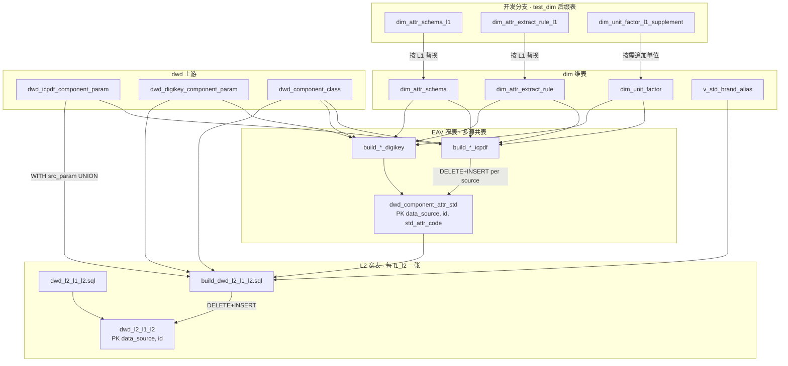
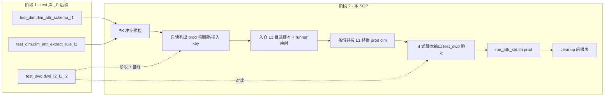

# 2.attribute_standard · 接入新 L1 属性标准化 SOP

适用场景：要把一个新 L1（电感 / PMIC / 驱动 IC / 新数据源专属 L1 等）的**属性抽取规则 + L2 宽表**合入主流程。

> **必读前置**：[`sql_scripts/test/README.md`](../test/README.md) —— 新 L1 必须先在测试库带 `_<l1>` 后缀做完阶段 1 验证；本 SOP 是阶段 2 "合并到主流程" 的标准动作。  
> **分类 + 属性完整总图**：[`../L1_STD_PIPELINE.md`](../L1_STD_PIPELINE.md)（须先完成 [`1.classify/CONTRIB.md`](../1.classify/CONTRIB.md) 分类合 prod）。

参考实施：
- 电阻 / 二极管 / 电容合并（commit `183d675`、`fcba503`）
- multi-source 改造 + DigiKey 试点（commit `bb834a9` 起 5 个 commit）

---

## 0. 设计原则（必读）

### 0.1 开发期后缀隔离，合并期按 L1 替换

- `dim.dim_attr_schema` PK `(schema_version, l1_code, scope_level, scope_code, std_attr_code)` 全局唯一
- `dim.dim_attr_extract_rule` PK `extract_rule_id` **全局唯一 + 必须带 L1 前缀**（如 `rs1509_*` / `d1509_*` / `cap*` / `<新L1>_*`）避免撞键
- `dim.dim_unit_factor` 全局共享单表，新 L1 缺单位时追加
- **`dim.dim_attr_extract_rule` 有 `data_source` 列**，跨源规则按源隔离（默认 `'icpdf'`，DigiKey/Mouser 等填对应源）

新 L1 开发期的真相源是 `test_dim.dim_attr_schema_<l1>` / `test_dim.dim_attr_extract_rule_<l1>`（以及可选 `test_dim.dim_unit_factor_<l1>_supplement`）和 `sql_scripts/test/<l1>/` 脚本。合并期以 L1 为替换单元：先备份并删除生产 `dim` 中该 L1 的旧 schema / extract rule，再从 `test_dim` 后缀表插入新规则；`dim_unit_factor` 只追加缺失单位，不按 L1 删除。

### 0.2 EAV `dwd.dwd_component_attr_std` 是多源共表

PK `(data_source, id, std_attr_code)`，DDL 见 [`dwd_component_attr_std.sql`](dwd_component_attr_std.sql)。

各源独立 build SQL，写同一张 EAV 表（`DELETE WHERE data_source='<src>' + INSERT`）：
- [`build_dwd_component_attr_std_icpdf.sql`](build_dwd_component_attr_std_icpdf.sql)
- [`build_dwd_component_attr_std_digikey.sql`](build_dwd_component_attr_std_digikey.sql)
- 未来：`build_dwd_component_attr_std_<source>.sql`

**新 L1 若只用 ICPDF/DigiKey 已支持的 `source_kind`**（`prajson_key_eq` / `prajson2_key_eq` / `param_taginfo_eq` / `taxonomy_from_dim` / `note_cn_eq` 等），**不需要改共享 EAV build SQL**，只维护 `test_dim.dim_attr_*_<l1>` 后缀表和 L1 目录下的 L2 脚本即可。引入新 `source_kind` 要先评审 + 单独扩共享 EAV build SQL。

### 0.3 L2 宽表命名 + 必备特性

- 命名：`dwd.dwd_l2_{l1}_{l2}`（**l1 前缀**），DDL 加 `data_source` 列（首位）+ PK `(data_source, id)`
- `{l2}` 来自分类层 `l2_code`，必须是 lowercase snake_case 且不带 `_base` 后缀
- `std_attr_code` 与 L2 宽表业务列名统一使用 lowercase snake_case；物理列名应尽量与 `std_attr_code` 一致
- 生产脚本目录：`sql_scripts/2.attribute_standard/<LL_l1_ready>/`，例如 `15_switch_ready`
- 新 L1 合并必须同步更新 `run_attr_std.sh` 的 `l1_dir()` 和 `l2_files_for_l1()`
- 模板：[`dwd_l2_resistor_fixed_resistor.sql`](11_resistor_ready/dwd_l2_resistor_fixed_resistor.sql) + [`build_dwd_l2_resistor_fixed_resistor.sql`](11_resistor_ready/build_dwd_l2_resistor_fixed_resistor.sql)
- build SQL 必备：
  - `WITH src_param AS (UNION ALL 各源 param 表)` —— 多源 param 字段统一
  - `LEFT JOIN dim.v_std_brand_alias a ON a.brand_key = UPPER(TRIM(p.brandshort))` —— 品牌标准化
  - `brand` / `brandid` = `COALESCE(a.canonical_name, p.brandshort)` / `COALESCE(a.brand_id_std, p.brandid)`
  - **`manufacturer` 禁止 COALESCE 兜底**——同品牌可能多制造商，EAV 抽不到就保留 NULL
  - `brand` 列宽 ≥ `VARCHAR(256)`（容纳"威世-VISHAY"）
  - WHERE 加 `AND c.l3_code NOT LIKE '%_unclassified'` 跳 L2_ONLY 兜底
  - JOIN 通用表加同源限定：`v.data_source = c.data_source`、`x.data_source = c.data_source`、`old.data_source = c.data_source`
  - GROUP BY 含 `c.data_source`

### 0.4 ❌ 反模式（硬约束）

- ❌ `manufacturer` 用 `COALESCE` 兜底到 `a.canonical_name`
- ❌ `brand` 列用 `VARCHAR(128)`
- ❌ `extract_rule_id` 不带 L1 前缀
- ❌ `std_attr_code` 或 L2 宽表业务列名使用非 lowercase snake_case 命名
- ❌ L2 scope / 表名沿用 `xxx_base`；落表前去掉 `_base`
- ❌ `_unclassified` L3 写入 L2 宽表
- ❌ `excluded_*` L2 加入 build WHERE（已由 `dim_attr_schema` 不收录该 scope 自然过滤）
- ❌ 用 BSD `sed \b`（macOS sed 不识别 `\b`），改用精确字面匹配或 python `re.sub(r'\b...', ...)`
- ❌ 给已有 L1 小改动套用新 L1 合并流程；小改动应单独评审变更范围后直接改生产规则
- ❌ 合并新品类时人工拼接共享规则文件；应从 `test_dim` 后缀表按 L1 替换，减少多人冲突

### 0.5 多人协作边界

- 每个新 L1 单独开 feature 分支，目录固定为 `sql_scripts/test/<l1>/`
- 分支内提交属性 schema、抽取规则、L2 DDL/build SQL、验收 SQL 与结果；不要直接改共享生产规则
- 分类阶段必须先完成并在 `dwd_component_class` 有该 L1 的稳定分类结果
- 合并人负责把该 L1 从后缀表替换到共享 dim，并重跑 EAV + L2；owner 负责规则解释、样本抽查和验收口径

### 0.6 数据流向（运行时）

> 分类层必须先产出 [`dwd.dwd_component_class`](../1.classify/dwd_component_class.sql)，见 [`1.classify/CONTRIB.md`](../1.classify/CONTRIB.md) 与 [`RULE_ENGINE.md`](../1.classify/RULE_ENGINE.md)。



统一入口：[`run_attr_std.sh`](run_attr_std.sh)（`SOURCES` 控制 EAV 源；`L1_LIST` 控制 L2 范围；仅刷 L2 用 `SOURCES=none`，勿用空字符串 `SOURCES=""`）。

---

## 1. 前置条件

- 仓库 clone，`sql_scripts/local.env` 或 shell `MYSQL_*` 已配
- 工作树干净（`git status`），从 `main` 切分支
- 该 L1 已在 [`dwd.dwd_component_class`](../1.classify/dwd_component_class.sql) 里（先做完 [`sql_scripts/1.classify/CONTRIB.md`](../1.classify/CONTRIB.md)）
- [`dim.dim_std_brand`](dim_std_brand.sql) + [`dim.v_std_brand_alias`](v_std_brand_alias.sql) 已上线
- **阶段 1 已在 `sql_scripts/test/<l1>/` 跑通**（含本 L1 dim 规则、EAV、3+ 张 L2，brand 100% 标准化、行数合理）
- L2 宽表名固定为 `dwd_l2_{l1}_{l2}`；即使在 `test_dwd` 中也不额外追加 `_<l1>`

---

## 2. 流程总览

```text
0. 阶段 1 已完成（test 库 _<l1> 后缀全链路验证通过）—— 见 sql_scripts/test/README.md

阶段 2：合并主流程（本 SOP）
  1. 接收同事分支并确认属性阶段后缀表 / L2 脚本仍可复跑
  2. PK / 命名 / scope / data_source 预检（schema / extract_rule / unit_factor 三表）
  3. 只读比对 test_dim 后缀表与生产 dim 旧 L1，将要删除/插入的 key 列出来
  4. 入仓 <LL_l1_ready>/dwd_l2_{l1}_{l2}.sql + build_dwd_l2_{l1}_{l2}.sql
  5. 更新 run_attr_std.sh 的 l1_dir() / l2_files_for_l1()
  6. 用户确认后，ALLOW_PROD=1：备份生产旧 L1 → 删除生产旧 L1 → 从 test_dim 后缀表插入生产 dim
  7. 用主干正式脚本输出到 test_dwd merge 临时表，和阶段 1 后缀表对比
  8. 验证通过后，ALLOW_PROD=1 重跑 prod EAV + 全 L2（含新 L1）
  9. cleanup test_dim/test_dwd 后缀表 + sql_scripts/test/<l1>/ 临时脚本
  10. git commit + push
```

### 2.1 阶段 2 合并流向（SOP）



---

## 3. 详细步骤

### Step 1 · PK 冲突预检

```sql
-- schema PK：必须 0；允许替换同一 L1 的旧 schema，但不能撞到其他 L1
SELECT COUNT(*) FROM (
  SELECT schema_version, l1_code, scope_level, scope_code, std_attr_code, COUNT(*) c FROM (
    SELECT schema_version, l1_code, scope_level, scope_code, std_attr_code
    FROM dim.dim_attr_schema
    WHERE l1_code <> '<l1>'
    UNION ALL
    SELECT schema_version, l1_code, scope_level, scope_code, std_attr_code FROM test_dim.dim_attr_schema_<l1>
  ) u GROUP BY 1,2,3,4,5 HAVING COUNT(*)>1
) x;

-- extract_rule PK：必须 0；允许替换同一 L1 / 同前缀旧规则，但不能撞到其他 L1
SELECT COUNT(*) FROM (
  SELECT extract_rule_id, COUNT(*) c FROM (
    SELECT extract_rule_id
    FROM dim.dim_attr_extract_rule
    WHERE l1_code <> '<l1>'
      AND extract_rule_id NOT REGEXP '^<l1>_'
    UNION ALL SELECT extract_rule_id FROM test_dim.dim_attr_extract_rule_<l1>
  ) u GROUP BY extract_rule_id HAVING COUNT(*)>1
) x;
```

返回非 0 → 停下，让该 L1 owner 重命名 `extract_rule_id`（加 `<l1>_` 前缀）。

### Step 2 · 合并前质量检查

对后缀表做最小审计，避免把不完整规则写入共享 dim：

```sql
-- schema 必须全是本 L1
SELECT l1_code, scope_level, COUNT(*)
FROM test_dim.dim_attr_schema_<l1>
GROUP BY 1, 2;

-- extract_rule_id 必须带 L1 前缀
SELECT extract_rule_id, COUNT(*)
FROM test_dim.dim_attr_extract_rule_<l1>
WHERE extract_rule_id NOT REGEXP '^<l1>_'
GROUP BY 1;

-- 抽取规则必须能落到本 L1 schema
SELECT r.std_attr_code, COUNT(*) AS rows_
FROM test_dim.dim_attr_extract_rule_<l1> r
LEFT JOIN test_dim.dim_attr_schema_<l1> s
  ON s.schema_version = r.schema_version
 AND s.l1_code = '<l1>'
 AND s.std_attr_code = r.std_attr_code
WHERE s.std_attr_code IS NULL
GROUP BY 1;

-- scope_code / std_attr_code 必须是 lowercase snake_case；L2 scope 禁止 _base 后缀
SELECT scope_level, scope_code, std_attr_code, COUNT(*) AS rows_
FROM test_dim.dim_attr_schema_<l1>
WHERE std_attr_code NOT REGEXP '^[a-z0-9]+(_[a-z0-9]+)*$'
   OR scope_code NOT REGEXP '^[a-z0-9]+(_[a-z0-9]+)*$'
   OR (scope_level = 'L2' AND scope_code REGEXP '_base$')
GROUP BY 1, 2, 3;
```

返回异常 → 停下，让 owner 在阶段 1 分支修正后重跑。

### Step 3 · 只读确认生产替换范围

不要删除或改写 `test_dim` 主表。测试库后缀表是本次合并的数据来源，生产 `dim` 是替换目标。先只读列出生产将删除的旧 key、以及将从测试库写入的新 key：

```sql
-- 生产旧 schema
SELECT schema_version, l1_code, scope_level, scope_code, std_attr_code
FROM dim.dim_attr_schema
WHERE l1_code = '<l1>'
ORDER BY schema_version, scope_level, scope_code, std_attr_code;

-- 生产旧 extract rule：按 extract_rule_id 前缀 + schema 归属双保险定位
SELECT extract_rule_id, data_source, schema_version, std_attr_code, source_kind
FROM dim.dim_attr_extract_rule
WHERE l1_code = '<l1>' OR extract_rule_id REGEXP '^<l1>_'
ORDER BY extract_rule_id;

-- 测试库待写入新 schema/rule 行数
SELECT 'new_schema' AS t, COUNT(*) FROM test_dim.dim_attr_schema_<l1>
UNION ALL
SELECT 'new_rule' AS t, COUNT(*) FROM test_dim.dim_attr_extract_rule_<l1>;
```

把上述结果给人工确认：删除范围必须只覆盖该 L1；插入行数必须等于阶段 1 验收的后缀表行数。

### Step 4 · 入仓 L1 目录脚本 + runner 映射

将阶段 1 通过验证的 L2 DDL/build 脚本迁移到：

```text
sql_scripts/2.attribute_standard/<LL_l1_ready>/
├── dwd_l2_<l1>_<l2>.sql
└── build_dwd_l2_<l1>_<l2>.sql
```

要求：

- 正式表名固定 `dwd.dwd_l2_{l1}_{l2}`，test/prod 都不额外追加 `_<l1>`
- DDL 含 `data_source` 首列、PK `(data_source, id)`、`brand VARCHAR(256)`
- 业务属性列名必须 lowercase snake_case，能与 `dim_attr_schema.std_attr_code` 对齐的列优先同名
- build SQL 使用主干多源模式：`src_param` CTE、`dim.v_std_brand_alias`、`dwd.dwd_component_attr_std`、`dim.dim_attr_schema`
- `manufacturer` 保持 EAV-only，禁止 COALESCE 到品牌
- 过滤 `_unclassified`

同步更新 [`run_attr_std.sh`](run_attr_std.sh)：

- `l1_dir()` 增加 `<l1>) echo "<LL_l1_ready>" ;;`
- `l2_files_for_l1()` 增加该 L1 的所有 `<l1>_<l2>` 后缀

### Step 5 · prod dim 按 L1 替换发布

用户确认后，在生产 `dim` 执行备份、删除、插入。以下 SQL 是模板，实际执行前把 `<l1>` 替换成小写 L1 code，并把 `<merge_tag>` 替换成本次合并标识（建议 `YYYYMMDDHHMM` 或分支短名），避免复用旧备份表。

```sql
CREATE TABLE dim.bak_dim_attr_schema_<l1>_<merge_tag> LIKE dim.dim_attr_schema;
CREATE TABLE dim.bak_dim_attr_extract_rule_<l1>_<merge_tag> LIKE dim.dim_attr_extract_rule;

INSERT INTO dim.bak_dim_attr_schema_<l1>_<merge_tag>
SELECT * FROM dim.dim_attr_schema WHERE l1_code = '<l1>';

INSERT INTO dim.bak_dim_attr_extract_rule_<l1>_<merge_tag>
SELECT *
FROM dim.dim_attr_extract_rule
WHERE l1_code = '<l1>' OR extract_rule_id REGEXP '^<l1>_';

DELETE FROM dim.dim_attr_extract_rule
WHERE l1_code = '<l1>' OR extract_rule_id REGEXP '^<l1>_';

DELETE FROM dim.dim_attr_schema WHERE l1_code = '<l1>';

INSERT INTO dim.dim_attr_schema
SELECT * FROM test_dim.dim_attr_schema_<l1>;

INSERT INTO dim.dim_attr_extract_rule
SELECT * FROM test_dim.dim_attr_extract_rule_<l1>;
```

`dim_unit_factor` 是共享单位表，不按 L1 删除。若有 `test_dim.dim_unit_factor_<l1>_supplement`，只追加不存在的 `unit_raw + quantity_kind` 组合，并人工确认不会改写已有换算。

```sql
INSERT INTO dim.dim_unit_factor
SELECT s.*
FROM test_dim.dim_unit_factor_<l1>_supplement s
LEFT JOIN dim.dim_unit_factor d
  ON d.target_unit = s.target_unit AND d.unit_raw = s.unit_raw
WHERE d.target_unit IS NULL;
```

执行前必须确认：

- `ALLOW_PROD=1` 是用户明确授权，不由 agent 自行假定
- 分类层 prod 已有该 L1，且 `dwd.dwd_component_class` 行数稳定
- prod 旧 L1 备份表已用本次 `<merge_tag>` 创建，且 `SELECT COUNT(*)` 有记录可追溯

### Step 6 · test_dwd 跑正式脚本验证

生产 dim 替换和 L1 目录脚本入仓后，先用主干正式脚本输出到 test_dwd merge 临时表，对比阶段 1 后缀表。原则：

- 读取生产 `dim.dim_attr_schema` / `dim.dim_attr_extract_rule`
- 读取生产 `dwd.dwd_component_class` 和源 param 表
- EAV 输出到 `test_dwd.dwd_component_attr_std_merge_<l1>`
- L2 输出到 `test_dwd.dwd_l2_<l1>_<l2>_merge`
- 不替换生产 `dim`，不写生产 `dwd`

验证查询：

```sql
SELECT data_source, COUNT(DISTINCT id) AS ids, COUNT(*) AS rows_
FROM test_dwd.dwd_component_attr_std_merge_<l1>
GROUP BY 1;

SELECT data_source, COUNT(*) AS rows_
FROM test_dwd.dwd_l2_<l1>_<l2>_merge
GROUP BY 1;
```

行数、brand 覆盖、关键字段空值率与阶段 1 后缀表差异超出预期时，不继续写 prod。

### Step 7 · prod EAV + L2 重跑

```bash
# 重建 EAV（INIT_EAV_DDL=1 会 DROP+CREATE EAV 表）+ 重跑所有 L1 + L2
ALLOW_PROD=1 INIT_EAV_DDL=1 SOURCES="icpdf digikey" \
  RES_ONLY=0 L1_LIST="resistor capacitor diode <l1>" \
  bash sql_scripts/2.attribute_standard/run_attr_std.sh prod
```

prod 校验：
```sql
SELECT data_source, COUNT(*) FROM dwd.dwd_component_attr_std GROUP BY 1;
SELECT data_source, l1_code, COUNT(*) FROM dwd.dwd_component_class GROUP BY 1,2 ORDER BY 1,2;

-- 每张新 L2 行数 + brand 覆盖
SELECT data_source, COUNT(*) FROM dwd.dwd_l2_<l1>_<l2> GROUP BY 1;
```

### Step 8 · cleanup

```sql
-- test_dim 后缀表
DROP TABLE IF EXISTS test_dim.dim_attr_schema_<l1>;
DROP TABLE IF EXISTS test_dim.dim_attr_extract_rule_<l1>;
-- (test_dim.dim_unit_factor_<l1>_supplement 如有)

-- test_dwd 后缀表
DROP TABLE IF EXISTS test_dwd.dwd_component_class_<l1>;
DROP TABLE IF EXISTS test_dwd.dwd_component_attr_std_<l1>;
DROP TABLE IF EXISTS test_dwd.dwd_component_attr_std_merge_<l1>;
-- 每张 L2（表名固定 dwd_l2_{l1}_{l2}，不再额外追加 _<l1>）
DROP TABLE IF EXISTS test_dwd.dwd_l2_<l1>_<l2>;
DROP TABLE IF EXISTS test_dwd.dwd_l2_<l1>_<l2>_merge;
```

```bash
git rm -r sql_scripts/test/<l1>/
```

### Step 9 · commit + push

```bash
git add sql_scripts/test/<l1>/ \
        sql_scripts/2.attribute_standard/dwd_l2_<l1>_*.sql \
        sql_scripts/2.attribute_standard/build_dwd_l2_<l1>_*.sql
git commit -m "feat(attribute_standard): add <l1> attr standardization scripts

prod 行数：
- EAV <l1>: NNN,NNN
- L2 <l1>_<l2_a>: NNN,NNN
- L2 <l1>_<l2_b>: NNN,NNN
- L2 <l1>_<l2_c>: NNN,NNN
"
# user 明确确认后 git push
```

---

## 4. 失败回滚

| 现象 | 处理 |
|---|---|
| Step 1 PK 冲突 | 停下，让 owner 加 `<l1>_` 前缀重新做阶段 1 |
| Step 2 质量检查失败 | 停下，让 owner 在分支内修正 `l1_code`、`extract_rule_id`、`scope_code`、`data_source` 后重跑阶段 1 |
| Step 3 替换范围不确定 | 先只查不删，列出生产将删除的 `extract_rule_id` / schema key 给人工确认；必要时建临时表驱动删除 |
| Step 5 写入生产后 schema/rule 行数异常 | 对比本次 `dim.bak_*_<l1>_<merge_tag>`、`test_dim.dim_attr_*_<l1>` 与生产主表，检查列序、NOT NULL、schema_version 是否一致 |
| Step 6 test_dwd 验证异常 | 先排查 dim 规则、L1 目录脚本、runner 映射和源数据差异，不要继续写 prod |
| Step 7 `brand_null > 0` | 该 L1 有 `brandshort` 不在 `dim_std_brand`，按 [`CONTRIB_BRAND.md`](CONTRIB_BRAND.md) 补 `dim_std_brand_manual_extra` 再 sync + 重跑 |
| Step 7 `dt ≠ di` | `v_std_brand_alias` 视图 jp_canonical 二级映射出问题（同名跨 manual_extra/jp_brand 未统一） |
| Step 7 行数远多于阶段 1 | 漏 `_unclassified` 过滤 |
| Step 7 误写 prod | 优先从本次 `dim.bak_*_<l1>_<merge_tag>` 恢复该 L1，不要全量 DROP 主表 |
| Step 7 prod 跑出后行数与阶段 1 差异 > 5% | 排查 prod 上的源 param 表与 test 期数据是否同步（新源 ods 增量？） |

---

## 5. 常用 audit 查询

```sql
-- 每 (data_source, l1) EAV 行数
SELECT s.data_source, c.l1_code, COUNT(*) AS rows_
FROM dwd.dwd_component_attr_std s
JOIN dwd.dwd_component_class c ON c.id = s.id AND c.data_source = s.data_source
GROUP BY 1, 2 ORDER BY 1, rows_ DESC;

-- L2 表品牌标准化覆盖率（按源拆）
SELECT data_source, COUNT(*) AS total,
  SUM(CASE WHEN brand IS NULL THEN 1 ELSE 0 END) AS null_,
  COUNT(DISTINCT brand) AS dt, COUNT(DISTINCT brandid) AS di
FROM dwd.dwd_l2_<l1>_<l2>
GROUP BY 1;

-- 某 L2 manufacturer 抽取率
SELECT data_source,
  COUNT(*) AS total,
  ROUND(100.0 * SUM(manufacturer IS NULL OR manufacturer='') / COUNT(*), 2) AS null_pct
FROM dwd.dwd_l2_<l1>_<l2>
GROUP BY 1;
```

---

## 6. 相关路径

| 路径 | 用途 |
|---|---|
| [`dim_attr_schema.sql`](dim_attr_schema.sql) / [`dim_attr_extract_rule.sql`](dim_attr_extract_rule.sql) / [`dim_unit_factor.sql`](dim_unit_factor.sql) | 三张 dim DDL |
| [`dwd_component_attr_std.sql`](dwd_component_attr_std.sql) | 多源 EAV DDL |
| [`build_dwd_component_attr_std_icpdf.sql`](build_dwd_component_attr_std_icpdf.sql) / [`build_dwd_component_attr_std_digikey.sql`](build_dwd_component_attr_std_digikey.sql) | 各源 EAV build |
| `<LL_l1_ready>/dwd_l2_<l1>_<l2>.sql` + `build_dwd_l2_<l1>_<l2>.sql` | 各 L1 分目录下的 L2 宽表 DDL/build |
| [`dwd_l2_resistor_fixed_resistor.sql`](11_resistor_ready/dwd_l2_resistor_fixed_resistor.sql) + build | **L2 模板**（最完整参考） |
| [`run_attr_std.sh`](run_attr_std.sh) | 多源 + 多 L1 一键 runner |
| [`../test/README.md`](../test/README.md) | 测试库后缀开发流程（**阶段 1**） |
| [`../1.classify/CONTRIB.md`](../1.classify/CONTRIB.md) | 分类合并 SOP |
| [`CONTRIB_BRAND.md`](CONTRIB_BRAND.md) | 品牌字典维护 |
| [`../PROD_CUTOVER.md`](../PROD_CUTOVER.md) | multi-source 架构 cutover 历史记录 |
