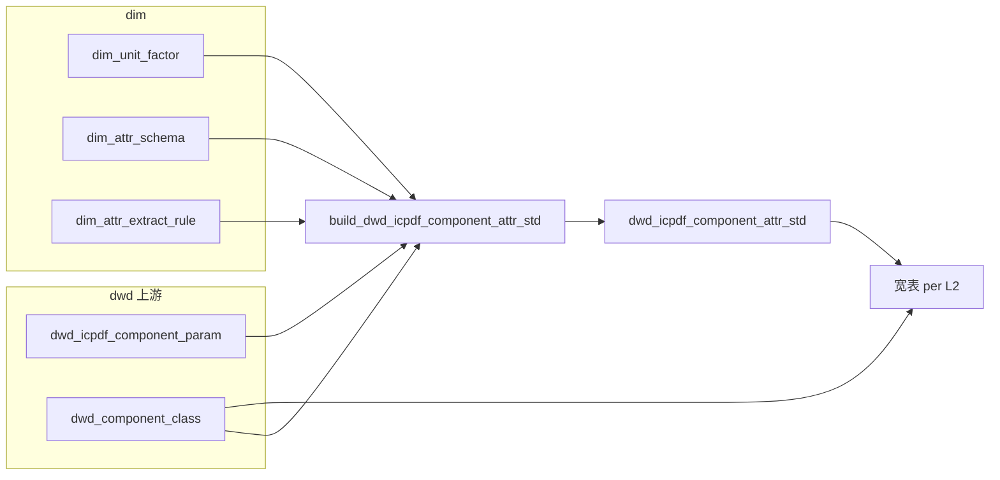

# ICDPDF 属性标准化（电阻落地 · 通用模式说明）

本文档说明 `sql_scripts/属性标准化/` 下的 **`dim` 维表 → `dwd_icpdf_component_attr_std` 窄表（EAV）→ 按 L2 透视的宽表** 链路。

- **当前仓库落地**：以 **电阻（`l1_code = resistor`）** 为完整示例（三个 L2 宽表 + 校验脚本）。
- **窄表装配逻辑**：**不写死电阻**，凡写入 **`dim_attr_schema`** 的 **`scope_level=l2`** 类目（任意 `l1_code`），只要 **`dwd_component_class` / `dwd_icpdf_component_param`** 有对应数据，即可产出窄表行。
- **给其他同事的用途**：复制同一模式到新 **`l1_code` / `l2_code`** 时，按文末 **「新开类目 Checklist」** 执行即可。

---

## 1. 解决什么问题

ICPDF 参数以 **`prajson` / `prajson2`**（及类目相关字段）入库，形态杂乱。流水线将其映射到统一的 **`std_attr_code`（snake_case）**，并完成 **字符串清洗、数值抽取、`dim_unit_factor` 单位换算**，最终：

| 产物 | 库 · 表 | 作用 |
|------|-----------|------|
| 属性字典 | `dim.dim_attr_schema` | 定义「哪个 L2/L3 有哪些标准属性」、类型、单位、边界 |
| 抽取规则 | `dim.dim_attr_extract_rule` | 定义「ICPDF 哪一路径命中哪个 `std_attr_code`」及优先级 |
| 单位换算 | `dim.dim_unit_factor` | `unit_raw` → `target_unit`（与 schema 中 `unit_std` 对齐） |
| **窄表** | `dwd.dwd_icpdf_component_attr_std` | 一行一个 `(id, std_attr_code)`，含原始值与标准化结果 |
| **宽表** | `dwd.dwd_l2_*`（电阻示例：`dwd_l2_fixed_resistor` 等） | **L2 字典属性 → 物理列**，**L3 → `ext_attributes` JSON |

前置条件：分类结果 **`dwd.dwd_component_class`**（`l1_code / l2_code / l3_code`）已与 **`dim_attr_schema`** 中 **`scope_code`** 对齐。

---

## 2. 数据流（示意）



电阻示例下 **`W1`** 对应 `dwd_l2_fixed_resistor`、`dwd_l2_variable_resistor`、`dwd_l2_protective_sensitive_resistor`；其它 L1 上线后应为各自 **`dwd_l2_<l2_code>_…`**（命名.team 内约定即可）。

---

## 3. 一键执行（电阻示例）

脚本：**`run_attr_std.sh`**

```bash
# 认证：环境变量 MYSQL_*，或创建 sql_scripts/local.env（参考 sql_scripts/local.env.example）
# run_attr_std.sh 会从「本脚本上级目录」加载 local.env，即 sql_scripts/local.env

cd sql_scripts/属性标准化
bash run_attr_std.sh
```

| 环境变量 | 默认 | 含义 |
|----------|------|------|
| `MYSQL_HOST` | `192.168.19.21` | StarRocks/MySQL FE |
| `MYSQL_PORT` | `9030` | 查询端口 |
| `MYSQL_USER` | `root` | 账号 |
| `MYSQL_PASSWORD` | （必填） | 密码 |
| `RUN_STD_ATTR_VALIDATE` | `1` | 是否在末尾执行 `validate_resistor_attr_std.sql`（仅电阻 fixed 抽样校验） |
| `RUN_STD_ATTR_AUDIT` | `0` | `1` 时将执行 `audit_resistor_prajson2_key_frequency.sql`（**仓库未必包含该文件**，启用前请确认路径存在） |

脚本顺序：**`dim` 三张表 SQL → 窄表（含 DROP 重建）→ 各 L2 宽表 DDL + `INSERT`**。

耗时与集群规模、数据量相关；可在脚本外包一层 **`time -p`** 做墙钟统计。

---

## 4. 手工执行顺序（与脚本一致）

1. `mysql … -D dim < dim_unit_factor.sql`
2. `mysql … -D dim < dim_attr_schema.sql`
3. `mysql … -D dim < dim_attr_extract_rule.sql`
4. `mysql … -D dwd < build_dwd_icpdf_component_attr_std.sql`
5. 电阻：**各 `dwd_l2_*_resistor.sql` → `build_dwd_l2_*_resistor.sql`**
6. （可选）`validate_resistor_attr_std.sql`

客户端建议使用 **`utf8mb4`**，避免中文 `$.cn` 乱码。

---

## 5. 核心对象说明

### 5.1 `dim.dim_attr_schema`

- **主键**：`(schema_version, l1_code, scope_level, scope_code, std_attr_code)`
- **`scope_level`**：`l2`（家族共用）或 `l3`（子类专有）
- **`scope_code`**：与 **`dwd_component_class.l2_code` / `l3_code`** 一致（如 `fixed_resistor`、`ntc_thermistor`）
- **`unit_std`**：须能在 **`dim_unit_factor.target_unit`** 找到换算（或留空走裸数值）
- **`min_bound` / `max_bound`**：超出则 `value_std_double` 置空并标 **`dq_flag = out_of_range`**

**版本约束**：窄表 CTE **`attr_l2_catalog`** 对每组 **`(l1_code, l2_code)`** 取 **`MAX(schema_version)`**，同一 L2 下 **勿并存多个版本的 schema 行**，以免歧义。

### 5.2 `dim.dim_attr_extract_rule`

- **主键**：`extract_rule_id`（**全局唯一**，跨 `l1_code` 也不得重复；建议前缀带类目，如 `rs1509_…`、`cap_…`）
- **`l1_code`**：必须与 **`dim_attr_schema`** 及 **`dwd_component_class`** 一致
- **`apply_scope_level` / `apply_scope_code`**：
  - **`NULL, NULL`**：不额外收窄；是否命中仍受 **`JOIN dim_attr_schema`**（按器件 `l2_code`/`l3_code`）约束
  - **`l2` / `l3` + 编码**：仅在该 L2/L3 上生效（适用于泛化 cn、taxonomy、与其它族隔离的规则）

同一 **`(id, std_attr_code)`** 多规则时，胜出有 **`ROW_NUMBER`**：**`priority` 升序，`extract_rule_id` 升序**。

**`source_kind` 摘要**（细则见 `dim_attr_extract_rule.sql` 文件头）：

| kind | 含义 |
|------|------|
| `prajson2_key_eq` | `prajson2` 顶层键名精确匹配 |
| `prajson_cn_eq` | `prajson` 数组元素 `$.cn` 全文精确匹配 |
| `prajson_sqlname_eq` | `$.sqlname` 精确匹配 |
| `param_category2_eq` / `param_category_eq` | 参数表类目字段 |
| `param_taginfo_eq` / `param_category_info_eq` | 数组元素匹配；常与 **`literal_std_value`** 做枚举归一 |

### 5.3 `dim.dim_unit_factor`

- **主键**：`(target_unit, unit_raw)`
- **语义**：`数值_std = 数值_raw × factor`（窄表 `scaled` CTE）

### 5.4 `dwd.dwd_icpdf_component_attr_std`（窄表）

- **主键**：`(id, std_attr_code)`
- **范围**：对 **`dim_attr_schema` 中出现的每一个 `(l1_code, scope_code)`（且 `scope_level=l2`）** 拉一份 **`schema_version = MAX(...)`**，再与 **`class`** 内 **`l1_code/l2_code`** 匹配的器件做抽取（不限电阻）。
- **`dq_flag`**：`out_of_range` / `parse_fail` / `NULL`

### 5.5 L2 宽表（透视约定）

参考 **`build_dwd_l2_fixed_resistor.sql`** 等：

- **`dim_attr_schema`**：**`scope_level=l2` 且 `scope_code` = 该行 `l2_code`** → **物理列**（列名 = `std_attr_code`）
- **`scope_level=l3` 且 `scope_code` = 该行 `l3_code`** → **`ext_attributes` JSON**（仅窄表中已成功解析的 `value_std_*`）

**`mpn`**：常见写法 **`COALESCE(窄表 mpn, param.partno)`**。

---

## 6. 多类目共用 dim 表时的重要约束（必读）

当前 **`dim_attr_schema.sql`**、**`dim_attr_extract_rule.sql`** 均以 **`DROP TABLE IF EXISTS …` + `CREATE` + `INSERT`** 方式装载：

| 影响 | 说明 |
|------|------|
| **整表替换** | 单次执行会 **清空该 dim 表的全部历史行**，再装入文件内正文。新增电容等类目时，必须把 **电阻 + 电容（及未来所有类目）** 的 INSERT **合并进同一套加载流程**，或改为团队约定的 **增量装载脚本**（需自行改 DDL 策略，不在当前电阻脚本范围内）。 |
| **窄表全量重算** | **`build_dwd_icpdf_component_attr_std.sql`** 对窄表 **`DROP` 重建**，一次写入 **当前 dim 定义下所有 L2** 的抽取结果。 |
| **规则 ID** | **`extract_rule_id`** 在 **`dim_attr_extract_rule` 全表唯一**，扩类目时勿与电阻前缀冲突。 |

---

## 7. 目录结构与电阻参考实现

**L2 宽表脚本按 L1 分目录**，目录名带 `dim_l3_classify_all` 的 L1 编号前缀：
`2.attribute_standard/<NN_l1>/dwd_l2_<l1>_<l2>.sql` + `build_dwd_l2_<l1>_<l2>.sql`
（如 `11_resistor_ready/`、`01_pmic_ready/`；mcu/mpu/dsp 合并在 `19_mcu_mpu_dsp_ready/`）。
全部 27 个 L1 目录已预建。**已梳理的目录带 `_ready` 后缀**（目录名即状态标识，文件树一眼可见）；
未梳理的目录无后缀、内含占位 `README.md`。
EAV 抽取（`build_dwd_component_attr_std_{icpdf,digikey}.sql`）、dim DDL、seed、`run_attr_std.sh` 等**共用脚本仍在根目录**；
`run_attr_std.sh` 按编号目录（`l1_dir()` 映射）自动寻址。

### L1 目录状态一览（编号 = `dim_l3_classify_all` l3_id 前两位）

| ✅ 已梳理（`_ready` 后缀） | ⏳ 待梳理（无后缀，占位） |
|---------------------|------------------|
| `01_pmic_ready` `05_diode_ready` `09_transistor_ready` `10_capacitor_ready` `11_resistor_ready` `12_inductor_ready` `15_switch_ready` `19_mcu_mpu_dsp_ready` `21_data_converter_ready` | `02_amplifier` `03_interface_communication_ic` `04_isolator` `06_transformer` `07_rf_wireless` `08_connector` `13_filter` `14_relay` `16_circuit_protection` `17_acoustic_device` `18_system_module` `20_storage` `22_logic_ic` `23_clock_timing` `24_sensor` `25_fpga_cpld` `26_optoelectronics` `27_driver_ic` |

> 快速查已梳理：`ls -d *_ready`

| L2 `l2_code` | 宽表 DDL / Build（在 `11_resistor_ready/` 下） |
|----------------|------------------|
| `fixed_resistor` | `11_resistor_ready/dwd_l2_resistor_fixed_resistor.sql` · `build_dwd_l2_resistor_fixed_resistor.sql` |
| `variable_resistor` | `11_resistor_ready/dwd_l2_resistor_variable_resistor.sql` · `build_…` |
| `protective_sensitive_resistor` | `11_resistor_ready/dwd_l2_resistor_protective_sensitive_resistor.sql` · `build_…` |

保护与敏感 **L3** 示例：`ntc_thermistor`、`ptc_thermistor`、`varistor_mov`、`fusible_resistor`、`other_sensitive_resistor`（须与 **`dim_l3_classify*`** / **`dim_attr_schema`** 一致）。

---

## 8. 新开类目 Checklist（复制当前模式）

适用于任意 **`l1_code`（如 capacitor）** 及下属 **`l2_code`**：

1. **分类对齐**：在 **`dwd_component_class`**（及 **`dim_l3_classify*` / 规则引擎如有）中落地 **`l1/l2/l3_code`**，并与 Excel/契约里的英文名一致。
2. **`dim_attr_schema`**：为该 L2/L3 定义 **`std_attr_code`、`db_type`、`unit_std`、边界等**；选定 **`schema_version`**（如 `capacitor_schema_v1.0.0`），且 **同一 `(l1_code,l2_code)` 仅保留一个版本**。
3. **`dim_attr_extract_rule`**：为每条 ICDPDF 路径添加规则；**`l1_code`、`schema_version`** 与 schema 对齐；**`extract_rule_id` 全局唯一**；慎用 **`NULL,NULL` + 泛化 cn**，必要时 **`apply_scope_level=l2`** 收窄。
4. **`dim_unit_factor`**：补齐新 **`unit_std` / unit_raw**。
5. **合并装载**：将新类目 INSERT **并入**现有 `dim_*.sql` 或编排 **连续多次 mysql 导入同一表且不 DROP**（若改为增量）；**禁止**只执行「仅含新类目」却 **DROP** 的旧电阻文件否则会删掉电阻维表。
6. **窄表**：执行 **`build_dwd_icpdf_component_attr_std.sql`**（与电阻共用）。
7. **宽表**：**每个 L2 复制一份电阻 build 模板**：改表名、`WHERE c.l2_code = '…'`、`dim_attr_schema` 过滤 `l1_code`（若同库多 L1）、以及 **`MAX(CASE WHEN std_attr_code = …)`** 列清单与 DDL。
8. **校验**：复制 **`validate_resistor_attr_std.sql`** 思路，写 **`WHERE l2_code = 'your_l2'`** 的覆盖率 / `dq_flag` 聚合。
9. **编排**：新增 **`run_<l1>_std_attr.sh`** 或在统一脚本中串联 **dim → narrow → 该类目全部宽表**。

---

## 9. 电阻域内：扩展字段 / 规则

（不改变 `l1_code`，仅扩电阻属性时）

1. **`dim_attr_schema.sql`**：在对应 `scope_level` + `scope_code` 下新增 `INSERT`。
2. **`dim_attr_extract_rule.sql`**：新增规则；避免与 **`rs1509/rs1510/th1509`** 等 **同通道重复**（除非 intentionally 不同优先级）。
3. **`dim_unit_factor.sql`**：新单位。
4. **宽表**：若新增 **L2 物理列**，同步改 **`dwd_l2_*.sql`** DDL 与 **`build_dwd_l2_*.sql`**。
5. 重跑：**维表 → 窄表 → 受影响宽表**。

---

## 10. 校验与键频溯源

- **`validate_resistor_attr_std.sql`**：面向 **`l2_code = fixed_resistor`** 窄表层面的覆盖率与 `dq_flag`。
- 键频：**`exports/dwd_icpdf_param_prajson_keys.csv`**、**`exports/dwd_icpdf_param_prajson2_keys.csv`**，用于对齐 **`source_expr`**。

---

## 11. 常见问题（FAQ）

**窄表里某个 L2 完全没数据**  
查 **`dwd_component_class`** 是否有该 **`l2_code`**；**`dim_attr_schema`** 是否在 **`scope_level=l2`** 下为该组合建档；该器件是否有 **`prajson`/`prajson2`**。

**有原始参数但标准值为空**  
查规则是否缺失、`dq_flag`、`dim_unit_factor`。

**同一 ICDPDF 键，不同 L2 要走不同列（如阻值）**  
用 **不同 `std_attr_code`**（如 `resistance_ohm` vs `resistance_25c_ohm`）+ **schema 按 L2 挂载**；规则 **`apply_scope`** 仅在需要隔离时使用 **`NULL,NULL`** 已由 schema JOIN 分流。

---

## 12. 相关路径索引

| 文件 | 用途 |
|------|------|
| `run_attr_std.sh` | 电阻一键跑通 |
| `dim_attr_schema.sql` | 属性字典（当前以电阻为主；扩类目须合并装载） |
| `dim_attr_extract_rule.sql` | 抽取与 taxonomy（同上） |
| `dim_unit_factor.sql` | 单位换算 |
| `build_dwd_icpdf_component_attr_std.sql` | **通用**窄表装配 |
| `build_dwd_l2_*_resistor.sql` | 电阻各 L2 宽表（**新类目可复制改名**） |
| `validate_resistor_attr_std.sql` | 电阻 fixed 校验样例 |

分类种子：**`sql_scripts/分类/`**、**`sql_scripts/generated/dim_l3_classify_all.sql`**（以仓库当前版本为准）。
