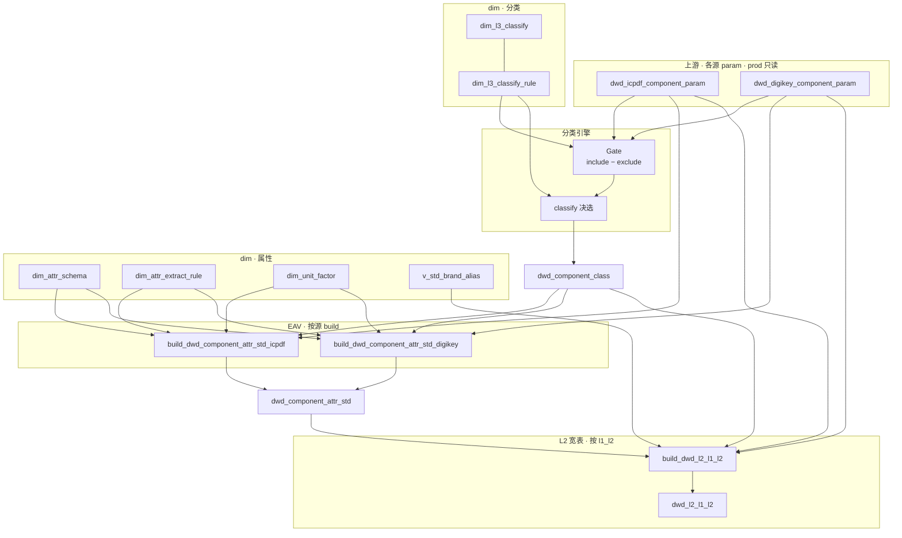
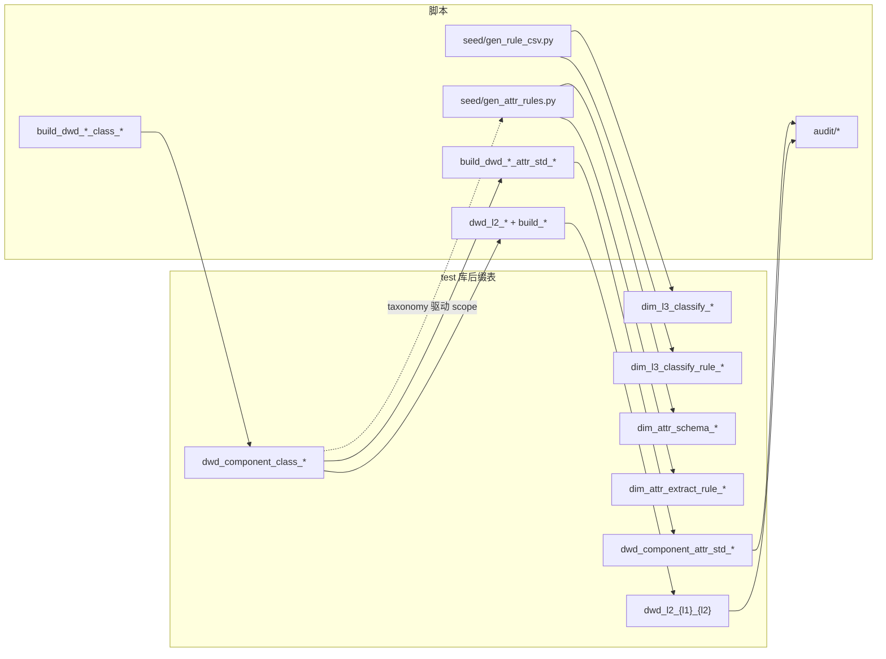
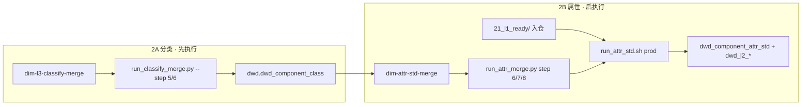

# L1 分类 + 属性清洗 · 端到端总览

适用：新接入或重做某个 **L1 大类**（如 `data_converter`、`inductor`）的完整标准化链路——**分类（gate + classify）→ 属性抽取（EAV）→ L2 宽表**，在 test 库验证后合入 prod。

| 分阶段详图 | 文档 |
|---|---|
| 仅分类 | [`1.classify/L1_CLASSIFY_PIPELINE.md`](1.classify/L1_CLASSIFY_PIPELINE.md) |
| 分类 SOP | [`1.classify/CONTRIB.md`](1.classify/CONTRIB.md) |
| 属性 SOP | [`2.attribute_standard/CONTRIB.md`](2.attribute_standard/CONTRIB.md) |
| 品牌字典 | [`2.attribute_standard/CONTRIB_BRAND.md`](2.attribute_standard/CONTRIB_BRAND.md) |
| test 后缀约定 | [`test/README.md`](test/README.md) |

---

## 1. 全流程总图（三阶段）

```mermaid
flowchart TB
  subgraph P1 [阶段 1 · test 库后缀隔离]
    direction TB
    subgraph P1C [1A 分类清洗]
      C1["探查 gate / 类目"]
      C2["gen_rule_csv.py · 分类规则"]
      C3["test_dim.dim_l3_classify_*<br/>test_dim.dim_l3_classify_rule_*"]
      C4["build_dwd_component_class_*<br/>→ test_dwd.dwd_component_class_*"]
      C5["验收：gate / L3 / 孤儿"]
      C1 --> C2 --> C3 --> C4 --> C5
    end
    subgraph P1A [1B 属性清洗 · 依赖 1A]
      A1["gen_attr_rules.py · schema + extract"]
      A2["test_dim.dim_attr_schema_*<br/>test_dim.dim_attr_extract_rule_*"]
      A3["品牌门控 audit/brand_gate_audit.py"]
      A4["build_dwd_component_attr_std_*<br/>→ test_dwd.dwd_component_attr_std_*"]
      A5["dwd_l2_* + build → test_dwd"]
      A6["验收：EAV / L2 填充率 / brand 100%"]
      A1 --> A2 --> A3 --> A4 --> A5 --> A6
    end
    C5 -->|"分类基线稳定"| A1
  end

  subgraph P2 [阶段 2 · 合 prod]
    direction TB
    subgraph P2C [2A 分类合 prod]
      CC1["PK / rule_id 预检"]
      CC2["替换 prod dim 分类树 + 规则"]
      CC3["主干引擎 → test_dwd merge<br/>run_classify_merge --step 5"]
      CC4["重跑 prod dwd_component_class<br/>--step 6"]
      CC1 --> CC2 --> CC3 --> CC4
    end
    subgraph P2A [2B 属性合 prod · 依赖 2A]
      AA1["PK / extract_rule_id 预检"]
      AA2["入仓 NN_l1_ready/ L2 脚本"]
      AA3["更新 run_attr_std.sh 映射"]
      AA4["替换 prod dim attr schema + rule"]
      AA5["正式脚本 → test_dwd merge 对比"]
      AA6["run_attr_std.sh prod"]
      AA1 --> AA2 --> AA3 --> AA4 --> AA5 --> AA6
    end
    CC4 --> AA1
  end

  subgraph P3 [阶段 3 · 清理]
    CL1["DROP test_dim / test_dwd 后缀表"]
    CL2["git rm sql_scripts/test/l1/"]
  end

  P1 -->|"阶段 1 全链路 PASS"| P2
  P2 --> P3
```



**顺序硬约束**：属性阶段始终依赖分类结果（`dwd_component_class` 中已有稳定 `l1/l2/l3`）；合 prod 时 **先分类 dim + DWD，再属性 dim + EAV + L2**。

---

## 2. 运行时数据流（prod 重跑）

每次刷新 prod 数据时，分类与属性按下列路径执行（与阶段无关）。



统一入口：

| 阶段 | 脚本 |
|---|---|
| 分类 DWD | [`1.classify/dwd_component_class.sql`](1.classify/dwd_component_class.sql) |
| 属性 EAV + L2 | [`2.attribute_standard/run_attr_std.sh`](2.attribute_standard/run_attr_std.sh) |

---

## 3. 阶段 1 步骤对照

目录：`sql_scripts/test/<l1>/`



| 步骤 | 分类 | 属性 |
|---|---|---|
| 规则真源 | `seed/gen_rule_csv.py` | `seed/gen_attr_rules.py` |
| 装载 test_dim | `load_rules_from_csv.py` | `load_attr_from_py.py` |
| 沙盒 build | `build_dwd_*_component_class_<l1>.sql` | `build_dwd_*_attr_std_<l1>.sql` |
| L2 | — | `dwd_l2_<l1>_<l2>.sql` + `build_*.sql` |
| 验收 | `validate_classify_rules.py` | `validate_attr_rules.py`、`phase1_l2_field_audit.py` |
| 品牌 | — | `brand_gate_audit.py`（`dim.v_std_brand_alias` 100%） |

**验收硬指标**（[`test/README.md`](test/README.md)）：

- 分类：gate 行数稳定、gate 内覆盖率 100%、L3 分布无吞噬
- 属性：`brand_null = 0`、关键 L2 列空值率达标、EAV 行数与分类 id 集合一致

---

## 4. 阶段 2 合 prod 步骤对照



| 顺序 | 分类 | 属性 |
|---|---|---|
| 预检 | `l3_id` / `rule_id` PK | `extract_rule_id` / schema PK |
| 替换 dim | `dim_l3_classify` + `dim_l3_classify_rule` | `dim_attr_schema` + `dim_attr_extract_rule` |
| test 验证 | merge 表 vs 阶段 1 基线 ±0.5% | merge EAV/L2 vs 后缀表 |
| 写 prod | `dwd_component_class.sql` | `run_attr_std.sh`（`ALLOW_PROD=1`） |
| 辅助脚本 | `test/<l1>/audit/run_classify_merge.py` | `test/<l1>/audit/run_attr_merge.py` |

**注意**

- 分类合 prod 后 **不要**用 `run_classify.sh prod`（会重建 dim）；直接跑主干 `dwd_component_class.sql`。
- 属性合 prod 前须完成 `run_attr_std.sh` 中 `l1_dir()` / `l2_files_for_l1()` 注册。
- `dim_unit_factor` 全局共享，新 L1 只 **追加** 缺失单位，不按 L1 删除。

---

## 5. 阶段 3 清理

```sql
-- test_dim
DROP TABLE IF EXISTS test_dim.dim_l3_classify_<l1>;
DROP TABLE IF EXISTS test_dim.dim_l3_classify_rule_<l1>;
DROP TABLE IF EXISTS test_dim.dim_attr_schema_<l1>;
DROP TABLE IF EXISTS test_dim.dim_attr_extract_rule_<l1>;

-- test_dwd
DROP TABLE IF EXISTS test_dwd.dwd_component_class_<l1>;
DROP TABLE IF EXISTS test_dwd.dwd_component_attr_std_<l1>;
DROP TABLE IF EXISTS test_dwd.dwd_l2_<l1>_<l2>;  -- 每张 L2
```

```bash
git rm -r sql_scripts/test/<l1>/
# 保留：sql_scripts/2.attribute_standard/<NN>_<l1>_ready/
```

---

## 6. Cursor Skills 与参考试点

| Skill / 试点 | 用途 |
|---|---|
| `.cursor/skills/dim-l3-classify-merge/SKILL.md` | 分类合 prod |
| `.cursor/skills/dim-attr-std-merge/SKILL.md` | 属性合 prod |
| `sql_scripts/test/data_converter/` | DigiKey ADC/DAC 全链路参考（`21_data_converter_ready/`） |
| [`sql_scripts/test/sensor/README.md`](test/sensor/README.md) | **传感器** L1 分类 + 属性清洗流程图（进行中） |

---

## 7. 参考数字（data_converter · DigiKey）

| 产物 | 行数 / 指标 |
|---|---|
| gate_pass | 11,103 |
| `dwd_component_class` | 11,103 |
| `dwd_component_attr_std` | ~232k 行 / 11,102 id |
| `dwd_l2_data_converter_adc` | 1,794 |
| `dwd_l2_data_converter_dac` | 9,309 |
| 品牌标准化 | 100%（`dim.v_std_brand_alias`） |
